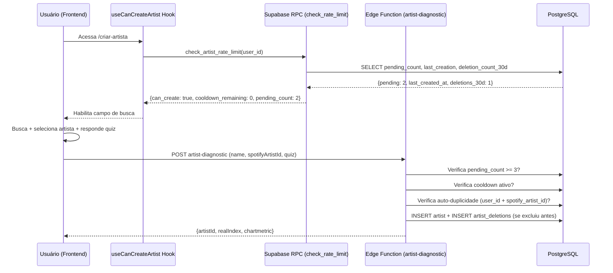
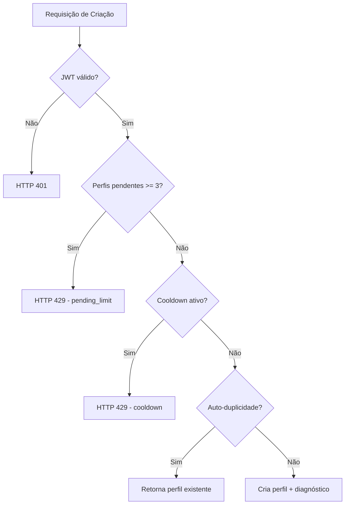

# Design: Rate Limit de Criação de Artista

## Overview

Este design implementa a remoção do bloqueio de duplicidade entre usuários e a adição de um mecanismo de rate limit progressivo para proteger contra abuso na geração de diagnósticos gratuitos (Índice REAL + Chartmetric).

**Mudanças principais:**
1. Substituição da RPC `check_spotify_artist_exists` por uma verificação de auto-duplicidade (mesmo `user_id` + mesmo `spotify_artist_id`)
2. Limite de 3 perfis pendentes (`is_locked = true`) simultâneos por usuário
3. Cooldown progressivo baseado no padrão de exclusões de perfis pendentes nos últimos 30 dias
4. Nova tabela `artist_deletions` para rastrear o histórico de exclusões
5. Validação tanto no frontend (UX imediata) quanto no backend (segurança)

**Decisões de design:**
- O cooldown é calculado de forma determinística a partir de dados do banco — sem necessidade de cache externo (Redis, etc.)
- A tabela `artist_deletions` é append-only: registros antigos (> 30 dias) podem ser removidos por cron, mas nunca editados
- A edge function `artist-diagnostic` continua sendo o ponto único de criação de perfis — o rate limit é uma camada adicionada antes da lógica existente
- O frontend faz uma verificação pré-voo (advisory) via RPC para UX responsiva, mas a fonte de verdade é o backend

## Architecture





## Components and Interfaces

### 1. Nova RPC: `check_artist_rate_limit`

Substitui a `check_spotify_artist_exists` como verificação pré-voo no frontend.

```sql
CREATE OR REPLACE FUNCTION check_artist_rate_limit(p_user_id uuid)
RETURNS jsonb AS $$
DECLARE
  v_pending_count int;
  v_last_created_at timestamptz;
  v_deletions_30d int;
  v_cooldown_seconds int;
  v_remaining_seconds int;
BEGIN
  -- Conta perfis pendentes do usuário
  SELECT count(*) INTO v_pending_count
  FROM artists
  WHERE user_id = p_user_id AND is_locked = true;

  -- Última criação do usuário
  SELECT max(created_at) INTO v_last_created_at
  FROM artists
  WHERE user_id = p_user_id;

  -- Contagem de exclusões de perfis pendentes nos últimos 30 dias
  SELECT count(*) INTO v_deletions_30d
  FROM artist_deletions
  WHERE user_id = p_user_id
    AND was_locked = true
    AND deleted_at > now() - interval '30 days';

  -- Calcula cooldown aplicável
  v_cooldown_seconds := CASE
    WHEN v_deletions_30d = 0 THEN 0
    WHEN v_deletions_30d = 1 THEN 600        -- 10 minutos
    WHEN v_deletions_30d BETWEEN 2 AND 4 THEN 86400  -- 24 horas
    ELSE 604800                                -- 7 dias
  END;

  -- Calcula tempo restante
  IF v_last_created_at IS NULL OR v_cooldown_seconds = 0 THEN
    v_remaining_seconds := 0;
  ELSE
    v_remaining_seconds := GREATEST(0,
      v_cooldown_seconds - EXTRACT(EPOCH FROM (now() - v_last_created_at))::int
    );
  END IF;

  RETURN jsonb_build_object(
    'can_create', (v_pending_count < 3 AND v_remaining_seconds = 0),
    'pending_count', v_pending_count,
    'pending_limit', 3,
    'cooldown_remaining_seconds', v_remaining_seconds,
    'cooldown_total_seconds', v_cooldown_seconds,
    'deletions_30d', v_deletions_30d
  );
END;
$$ LANGUAGE plpgsql SECURITY DEFINER;
```

### 2. Nova RPC: `check_self_duplicate`

Verificação leve de auto-duplicidade (substitui parte da lógica de `check_spotify_artist_exists`).

```sql
CREATE OR REPLACE FUNCTION check_self_duplicate(p_user_id uuid, p_spotify_id text)
RETURNS boolean AS $$
BEGIN
  RETURN EXISTS (
    SELECT 1 FROM artists
    WHERE user_id = p_user_id AND spotify_artist_id = p_spotify_id
  );
END;
$$ LANGUAGE plpgsql SECURITY DEFINER;
```

### 3. Edge Function `artist-diagnostic` — Modificações

**Adições no início do handler (antes de toda lógica existente):**

```typescript
// ── Rate Limit: verificações obrigatórias ──────────────────────────────────
// 1. Pending count
const { count: pendingCount } = await supabaseAdmin
  .from("artists")
  .select("*", { count: "exact", head: true })
  .eq("user_id", user.id)
  .eq("is_locked", true);

if (pendingCount === null) return json({ error: "Erro ao verificar limites" }, 500);
if (pendingCount >= 3) {
  return json({
    error: "Limite de perfis pendentes atingido",
    reason: "pending_limit",
    pending_count: pendingCount,
  }, 429);
}

// 2. Cooldown
const { data: deletions30d } = await supabaseAdmin
  .from("artist_deletions")
  .select("id", { count: "exact", head: true })
  .eq("user_id", user.id)
  .eq("was_locked", true)
  .gte("deleted_at", new Date(Date.now() - 30 * 24 * 60 * 60 * 1000).toISOString());

const deletionCount = deletions30d ?? 0;
const cooldownSeconds = deletionCount === 0 ? 0
  : deletionCount === 1 ? 600
  : deletionCount <= 4 ? 86400
  : 604800;

if (cooldownSeconds > 0) {
  const { data: lastArtist } = await supabaseAdmin
    .from("artists")
    .select("created_at")
    .eq("user_id", user.id)
    .order("created_at", { ascending: false })
    .limit(1)
    .maybeSingle();

  if (lastArtist?.created_at) {
    const elapsed = (Date.now() - new Date(lastArtist.created_at).getTime()) / 1000;
    const remaining = Math.ceil(cooldownSeconds - elapsed);
    if (remaining > 0) {
      return json({
        error: "Cooldown ativo",
        reason: "cooldown",
        remaining_seconds: remaining,
        deletion_count: deletionCount,
      }, 429);
    }
  }
}

// 3. Auto-duplicidade (substitui check_spotify_artist_exists global)
if (spotifyId) {
  const { data: selfDup } = await supabaseAdmin
    .from("artists")
    .select("id, name")
    .eq("user_id", user.id)
    .eq("spotify_artist_id", spotifyId)
    .maybeSingle();

  if (selfDup) {
    return reusedResponse(selfDup);
  }
}
```

**Remoções:**
- Remove a trava `pending` que permite apenas 1 perfil não-pago (substituída pelo limite de 3)
- Remove qualquer referência à RPC `check_spotify_artist_exists`

### 4. Hook `useCanCreateArtist` — Reescrita

```typescript
export interface CanCreateArtistResult {
  canCreate: boolean;
  reason: 'pending_limit' | 'cooldown' | 'error' | null;
  pendingCount: number;
  pendingLimit: number;
  cooldownRemainingSeconds: number;
  cooldownTotalSeconds: number;
  deletions30d: number;
  loading: boolean;
  error: boolean;
  retry: () => void;
}
```

### 5. Trigger de Exclusão (registra em `artist_deletions`)

```sql
CREATE OR REPLACE FUNCTION fn_track_artist_deletion()
RETURNS trigger AS $$
BEGIN
  INSERT INTO artist_deletions (user_id, artist_id, spotify_artist_id, artist_name, was_locked)
  VALUES (OLD.user_id, OLD.id, OLD.spotify_artist_id, OLD.name, OLD.is_locked);
  RETURN OLD;
END;
$$ LANGUAGE plpgsql SECURITY DEFINER;

CREATE TRIGGER trg_artist_deletion
  BEFORE DELETE ON artists
  FOR EACH ROW
  EXECUTE FUNCTION fn_track_artist_deletion();
```

## Data Models

### Nova Tabela: `artist_deletions`

| Coluna | Tipo | Descrição |
|--------|------|-----------|
| `id` | uuid (PK, default gen_random_uuid()) | Identificador único |
| `user_id` | uuid (FK → auth.users, NOT NULL) | Usuário que excluiu |
| `artist_id` | uuid (NOT NULL) | ID do artista excluído (referência histórica) |
| `spotify_artist_id` | text | Spotify ID do artista excluído |
| `artist_name` | text (NOT NULL) | Nome do artista no momento da exclusão |
| `was_locked` | boolean (NOT NULL, default true) | Se o perfil estava pendente (is_locked) no momento da exclusão |
| `deleted_at` | timestamptz (NOT NULL, default now()) | Timestamp da exclusão |

**Índices:**
- `idx_artist_deletions_user_30d` on `(user_id, deleted_at)` WHERE `was_locked = true` — otimiza a query principal de contagem de cooldown
- `idx_artist_deletions_user_id` on `(user_id)` — listagens genéricas

**RLS:**
- `SELECT`: usuário pode ver apenas suas próprias exclusões (`user_id = auth.uid()`)
- `INSERT`: apenas via trigger (SECURITY DEFINER) — nenhuma política de INSERT para o role `authenticated`
- `DELETE/UPDATE`: nenhuma (append-only)

### Alteração na Tabela `artists`

**Remoção de constraint:**
- Remove a UNIQUE constraint em `spotify_artist_id` (se existir globalmente)
- Adiciona UNIQUE constraint composta: `(user_id, spotify_artist_id)` — garante unicidade por usuário

```sql
-- Remove constraint global se existir
ALTER TABLE artists DROP CONSTRAINT IF EXISTS artists_spotify_artist_id_key;

-- Adiciona constraint por usuário
ALTER TABLE artists ADD CONSTRAINT artists_user_spotify_unique
  UNIQUE (user_id, spotify_artist_id);
```

### Remoção da RPC `check_spotify_artist_exists`

A RPC antiga será removida (ou mantida temporariamente com deprecation) e substituída por:
- `check_self_duplicate` — verifica se o mesmo user_id já tem o spotify_artist_id
- `check_artist_rate_limit` — retorna status completo de rate limit

## Correctness Properties

*Uma propriedade é uma característica ou comportamento que deve ser verdadeiro em todas as execuções válidas de um sistema — essencialmente, uma declaração formal sobre o que o sistema deve fazer. Propriedades servem como ponte entre especificações legíveis por humanos e garantias de corretude verificáveis por máquinas.*

### Property 1: Criação entre usuários distintos é sempre permitida

*Para qualquer* par de `user_id` distintos e qualquer `spotify_artist_id` válido, se o primeiro usuário já possui um perfil para esse artista, o segundo usuário deve conseguir criar um perfil para o mesmo artista sem bloqueio.

**Validates: Requirements 1.1, 1.3**

### Property 2: Auto-duplicidade é sempre bloqueada

*Para qualquer* `user_id` e `spotify_artist_id`, se já existe um registro com essa combinação exata, uma tentativa de criação com os mesmos valores deve ser rejeitada.

**Validates: Requirements 1.2**

### Property 3: Limite de perfis pendentes

*Para qualquer* `user_id` e qualquer contagem N de perfis com `is_locked = true` pertencentes a esse usuário, a criação de um novo perfil deve ser permitida se e somente se N < 3.

**Validates: Requirements 2.1, 2.2, 4.2**

### Property 4: Acurácia da contagem de perfis pendentes

*Para qualquer* conjunto de registros na tabela `artists`, a contagem de perfis pendentes de um `user_id` deve ser exatamente igual ao número de registros onde `user_id = U` AND `is_locked = true`. Registros de outros usuários ou com `is_locked = false` nunca devem ser contados.

**Validates: Requirements 2.3, 2.4**

### Property 5: Acurácia da contagem de exclusões (janela de 30 dias)

*Para qualquer* conjunto de registros em `artist_deletions` e qualquer timestamp `now`, a contagem de exclusões para um `user_id` nos últimos 30 dias deve ser exatamente igual ao número de registros onde `user_id = U` AND `was_locked = true` AND `deleted_at > now - 30 dias`. Exclusões de perfis pagos (`was_locked = false`) nunca devem ser contadas.

**Validates: Requirements 3.2, 3.10**

### Property 6: Cálculo determinístico do cooldown

*Para qualquer* contagem de exclusões `D` nos últimos 30 dias e qualquer `last_created_at`, o cooldown aplicável deve ser: 0 se D=0, 600s se D=1, 86400s se 2≤D≤4, 604800s se D≥5. O tempo restante deve ser `max(0, cooldown - (now - last_created_at))`.

**Validates: Requirements 3.3, 3.4, 3.5, 3.6, 3.7, 3.8, 4.3**

### Property 7: Prioridade de restrições

*Para qualquer* estado onde tanto o limite de pendentes quanto o cooldown estão ativos simultaneamente, o sistema deve reportar a restrição de "pending_limit" como prioritária (o frontend exibe apenas essa mensagem).

**Validates: Requirements 5.3**

## Error Handling

| Cenário | Frontend | Backend (Edge Function) |
|---------|----------|------------------------|
| DB indisponível na verificação de pendentes | Exibe erro temporário + botão retry | HTTP 500 — bloqueia criação |
| DB indisponível na verificação de duplicidade | Permite fluxo prosseguir (constraint protege) | Constraint `artists_user_spotify_unique` rejeita duplicata |
| JWT ausente/inválido | Redirect para login | HTTP 401 |
| Rede indisponível (frontend → RPC) | Exibe erro temporário + botão retry | N/A |
| Timeout na Chartmetric API | N/A (backend) | Prossegue sem dados Chartmetric (diagnóstico parcial) |
| Rate limit violado (429) | Exibe mensagem específica (pending ou cooldown) | Retorna JSON estruturado com reason + dados |

**Princípio fail-safe:**
- Se a verificação de rate limit falhar no backend → **bloqueia** (fail closed)
- Se a verificação de auto-duplicidade falhar → **permite** (constraint do banco protege)
- Se o frontend não conseguir verificar → **exibe erro** e oferece retry

## Testing Strategy

### Testes de Propriedade (Property-Based Tests)

Biblioteca: **fast-check** (já instalada no projeto, v3.23.2)
Configuração: mínimo 100 iterações por propriedade.

Cada propriedade do design será implementada como um teste PBT com a tag:
```
Feature: artist-creation-rate-limit, Property {N}: {texto}
```

**Foco dos testes de propriedade:**
- Função `computeCooldown(deletionCount)` — pura, determinística
- Função `computeRemainingSeconds(lastCreatedAt, cooldownSeconds, now)` — pura
- Função `countPendingProfiles(profiles[])` — filtragem
- Função `countDeletions30d(deletions[], now)` — filtragem por janela temporal
- Função `canCreate(pendingCount, remainingSeconds)` — lógica combinada
- Função `getRestrictionPriority(pendingBlocked, cooldownBlocked)` — prioridade
- Validação de duplicidade: `isSelfDuplicate(existingProfiles[], userId, spotifyId)`

### Testes Unitários (Exemplos e Edge Cases)

- Edge function retorna 401 sem JWT
- Edge function retorna 429 com formato correto para pending_limit
- Edge function retorna 429 com formato correto para cooldown
- Primeiro usuário sem histórico: criação liberada sem restrições
- Trigger `fn_track_artist_deletion` registra corretamente o histórico
- Hook `useCanCreateArtist` exibe estado correto para cada cenário
- Contagem regressiva atualiza a cada 60 segundos no frontend
- Auto-refresh quando cooldown expira

### Testes de Integração

- Fluxo completo: criar → excluir → verificar cooldown → aguardar → criar de novo
- Constraint `artists_user_spotify_unique` rejeita duplicata real no banco
- RPC `check_artist_rate_limit` retorna valores consistentes com estado do banco
- Trigger popula `artist_deletions` corretamente ao excluir um artista
