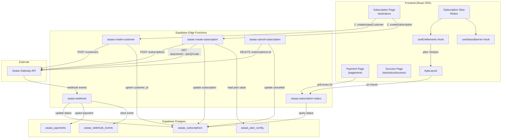

# Design Document: Asaas Payment E2E

## Overview

Este documento descreve a arquitetura técnica do fluxo de pagamento end-to-end com o gateway Asaas na plataforma Maestra. A integração já está substancialmente implementada — este design documenta a arquitetura existente e identifica os pontos de hardening necessários para garantir robustez, resiliência e correção do fluxo completo.

O sistema opera em três camadas:
1. **Frontend (React + Redux)**: Páginas de checkout, pagamento PIX, sucesso; gerenciamento de estado via subscription slice; derivação de entitlements.
2. **Backend (Supabase Edge Functions)**: Intermediação com a API Asaas para criação de clientes, assinaturas, consulta de status e cancelamento; processamento de webhooks.
3. **Banco de dados (Supabase/Postgres)**: Tabelas `asaas_subscriptions`, `asaas_payments`, `asaas_webhook_events`, `asaas_plan_config`.

### Fluxos Suportados

- **PIX**: Usuário → cria customer → cria subscription PIX → exibe QR Code → polling até confirmação → ativação Pro
- **Cartão de Crédito**: Usuário → cria customer → cria subscription CC → cobrança imediata → ativação Pro
- **Webhook**: Asaas notifica eventos → webhook handler atualiza banco → polling detecta mudança
- **Cancelamento**: Usuário confirma → Edge Function cancela no Asaas → atualiza banco

## Architecture



### Estado Global (Redux)

O `subscription` slice é a single source of truth para o estado da assinatura no frontend:

```
SubscriptionState {
  status: 'active' | 'overdue' | 'cancelled' | 'pending' | 'none'
  asaasCustomerId: string | null
  asaasSubscriptionId: string | null
  nextDueDate: string | null
  value: number | null
  gracePeriodEndsAt: string | null
  loading: boolean
  error: string | null
  pixData: { qrCode, copyPaste, expiresAt } | null
  initialized: boolean  // false até primeira resposta do servidor
}
```

## Components and Interfaces

### Edge Functions

| Function | Method | Auth | Responsabilidade |
|----------|--------|------|-----------------|
| `asaas-create-customer` | POST | JWT (user) | Cria/retorna cliente Asaas, associa ao user_id |
| `asaas-create-subscription` | POST | JWT (user) | Cria assinatura PIX ou CC, retorna pixData |
| `asaas-subscription-status` | GET/POST | JWT (user) | Consulta status da assinatura no banco |
| `asaas-cancel-subscription` | POST/DELETE | JWT (user) | Cancela assinatura no Asaas e no banco |
| `asaas-webhook` | POST | `asaas-access-token` header | Processa eventos do Asaas, atualiza banco |

### Frontend Components

| Component | Path | Responsabilidade |
|-----------|------|-----------------|
| `SubscriptionPage` | `/assinatura` | Form de checkout com PIX/CC, validação, submit |
| `PaymentPage` | `/pagamento` | QR Code PIX, countdown, polling, copy-paste |
| `SubscriptionSuccess` | `/assinatura/sucesso` | Confirmação de pagamento com CTA |
| `AppLayout` | wrapper | Dispatch `fetchSubscriptionStatus`, renderiza StatusBanner |
| `AnnouncementBanner` | bottom bar | Banner genérico com variantes promo/warning/info |
| `StatusBanner` | via AppLayout | Banner específico de status de assinatura |

### Hooks

| Hook | Responsabilidade |
|------|-----------------|
| `useEntitlements` | Deriva `plan` (free/pro) e feature flags a partir do status |
| `useStatusBanner` | Decide qual banner exibir (promo/grace/pending/null) |
| `useSubscriptionGuard` | Guard de acesso com cache e polling periódico |

### Pure Functions (Testáveis via PBT)

| Function | Localização | Descrição |
|----------|-------------|-----------|
| `deriveEntitlements(status, gracePeriodEndsAt, now)` | `hooks/useEntitlements.ts` | Regra de negócio: status → plan |
| `isValidCpf(cpf)` / `isValidCnpj(cnpj)` | `pages/Subscription/index.tsx` + `asaas-create-customer/index.ts` | Validação de documento |
| `formatCountdown(seconds)` | `pages/Payment/index.tsx` | Formata segundos em mm:ss |
| Validação de campos CC | `pages/Subscription/index.tsx` | Valida número, nome, validade, CVV, phone, CEP |

## Data Models

### asaas_subscriptions

| Column | Type | Descrição |
|--------|------|-----------|
| id | uuid (PK) | ID interno |
| user_id | uuid (FK → auth.users, UNIQUE) | Dono da assinatura |
| asaas_customer_id | text | ID do cliente no Asaas |
| asaas_subscription_id | text | ID da assinatura no Asaas |
| status | text | 'active', 'overdue', 'cancelled', 'pending', 'none' |
| value | numeric | Valor mensal |
| billing_type | text | 'PIX' ou 'CREDIT_CARD' |
| next_due_date | timestamptz | Próximo vencimento |
| grace_period_ends_at | timestamptz | Fim do período de graça (null se ativo) |
| started_at | timestamptz | Início da assinatura |
| created_at | timestamptz | Criação do registro |
| updated_at | timestamptz | Última atualização |

### asaas_payments

| Column | Type | Descrição |
|--------|------|-----------|
| id | uuid (PK) | ID interno |
| user_id | uuid (FK) | Dono do pagamento |
| asaas_payment_id | text (UNIQUE) | ID do pagamento no Asaas |
| value | numeric | Valor pago |
| status | text | 'confirmed', 'received', 'overdue', 'deleted', 'pending' |
| billing_type | text | Tipo de cobrança |
| payment_date | date | Data do pagamento |
| created_at | timestamptz | Criação do registro |
| updated_at | timestamptz | Última atualização |

### asaas_webhook_events

| Column | Type | Descrição |
|--------|------|-----------|
| id | uuid (PK) | ID interno |
| event_id | text (UNIQUE) | ID do evento Asaas (idempotência) |
| event_type | text | Tipo do evento (PAYMENT_CONFIRMED, etc.) |
| payload | jsonb | Payload completo do webhook |
| processed_at | timestamptz | Quando foi processado |

### asaas_plan_config

| Column | Type | Descrição |
|--------|------|-----------|
| id | uuid (PK) | ID interno |
| monthly_value | numeric | Valor mensal do plano |
| is_active | boolean | Se é o plano ativo |

## Correctness Properties

*A property is a characteristic or behavior that should hold true across all valid executions of a system — essentially, a formal statement about what the system should do. Properties serve as the bridge between human-readable specifications and machine-verifiable correctness guarantees.*

### Property 1: CPF/CNPJ Validation Correctness

*For any* string of 11 digits that satisfies the CPF check-digit algorithm, `isValidCpf` SHALL return `true`; and *for any* string of 11 digits that does NOT satisfy the check-digit algorithm (including all-same-digit strings), `isValidCpf` SHALL return `false`. Analogously, *for any* string of 14 digits, `isValidCnpj` SHALL return `true` if and only if it satisfies the CNPJ check-digit algorithm.

**Validates: Requirements 1.3**

### Property 2: Credit Card Field Validation Correctness

*For any* combination of credit card fields (number: string, holderName: string, expiry: string, cvv: string, phone: string, cep: string), the `validateForm` function SHALL return `null` (valid) if and only if: number has 13–19 digits, holderName has 3–100 characters after trim, expiry has exactly 4 digits in MMYY format, CVV has 3–4 digits, phone has 10–11 digits, and CEP has exactly 8 digits. For any input failing any of these constraints, it SHALL return a non-null error string.

**Validates: Requirements 3.4, 3.5**

### Property 3: Countdown Timer Formatting

*For any* non-negative integer `seconds`, `formatCountdown(seconds)` SHALL return a string in `mm:ss` format where `mm` equals `Math.floor(seconds / 60)` zero-padded to 2 digits and `ss` equals `seconds % 60` zero-padded to 2 digits. For `seconds <= 0`, it SHALL return `"00:00"`.

**Validates: Requirements 4.3**

### Property 4: Webhook Event Status Mapping

*For any* valid webhook event with `event_type` in `{PAYMENT_CONFIRMED, PAYMENT_RECEIVED}`, the webhook handler SHALL set the subscription status to `'active'`. *For any* event with `event_type === 'PAYMENT_OVERDUE'`, it SHALL set status to `'overdue'` and set `grace_period_ends_at` to a timestamp in the future (relative to event processing time). *For any* event with `event_type` in `{SUBSCRIPTION_DELETED, SUBSCRIPTION_INACTIVATED, PAYMENT_DELETED}`, it SHALL set status to `'cancelled'`.

**Validates: Requirements 5.1, 5.2, 5.3, 5.4**

### Property 5: Webhook Idempotency

*For any* webhook event with a given `event_id`, processing the event a second time SHALL result in HTTP 200 without modifying the subscription status or payment records. The database state after processing a duplicate SHALL be identical to the state after the first processing.

**Validates: Requirements 5.7, 5.8**

### Property 6: Entitlements Derivation Correctness

*For any* subscription status and `gracePeriodEndsAt` timestamp, `deriveEntitlements(status, gracePeriodEndsAt, now)` SHALL return `plan: 'pro'` if and only if: (a) `PAYWALL_DISABLED` is `true`, OR (b) `status === 'active'`, OR (c) `status === 'overdue'` AND `gracePeriodEndsAt` is not null AND `now < new Date(gracePeriodEndsAt).getTime()`. In all other cases, it SHALL return `plan: 'free'`. When plan is `'pro'`, all feature flags SHALL be `true` and limits SHALL be `Infinity`.

**Validates: Requirements 6.6, 10.2**

## Error Handling

### Frontend Error Strategy

| Cenário | Comportamento |
|---------|---------------|
| Network error em qualquer Edge Function | `error` armazenado no slice em português, ≤ 200 chars |
| Timeout (30s) | Mensagem: "Falha na comunicação com serviço de pagamento" |
| Erro de validação (CPF, cartão) | Erro inline no formulário, submit desabilitado |
| Erro pós-submit | Alert dismissível (Ant Design) que limpa o erro ao fechar |
| Polling: 1 erro de rede | Skip iteração, continua no próximo intervalo |
| Polling: 3 erros consecutivos | Para polling, exibe mensagem de conectividade com retry |
| pixData ausente na Payment_Page | Redirect para /assinatura em ≤ 1 segundo |
| QR Code expirado | Mensagem de expiração, botão Copiar desabilitado, polling parado |

### Backend Error Strategy

| Cenário | Comportamento |
|---------|---------------|
| Asaas API retorna erro | Edge Function retorna 502 com mensagem genérica |
| Asaas API timeout (30s) | AbortController + mensagem de indisponibilidade |
| DB write error no webhook | Retorna 500, evento NÃO marcado como processado (Asaas retenta) |
| Webhook com event_id desconhecido | Armazena evento, retorna 200, skip updates |
| Token webhook inválido | 401 sem processamento |
| Erro inesperado no webhook | Retorna 200 (previne loop de retentativas infinitas) |
| Plan config indisponível | 404 com mensagem "Plano ativo não encontrado" |

### Decisão de Design: Webhook retorna 200 em erros inesperados

O webhook handler retorna HTTP 200 mesmo em erros inesperados (`catch` geral) para evitar que o Asaas entre em loop de retentativas. Erros estruturais (DB write failure) retornam 500 para permitir retry automático, pois são transitórios.

**Gap identificado**: O webhook atual usa `grace_period_ends_at = now + 72h` para PAYMENT_OVERDUE, mas os requirements especificam 7 dias. Este é um ponto de hardening a ser corrigido.

## Testing Strategy

### Dual Testing Approach

O projeto usa **Jest** (via react-scripts) para testes unitários e **fast-check** (já instalado) para property-based testing.

#### Property-Based Tests (fast-check)

Cada propriedade documentada na seção Correctness Properties será implementada com um teste property-based:

- **Mínimo 100 iterações** por propriedade
- **Tag format**: `Feature: asaas-payment-e2e, Property {N}: {título}`
- **Localização**: `src/hooks/__tests__/` e `src/pages/__tests__/` (seguindo padrão existente)

Propriedades a implementar:
1. CPF/CNPJ validation — gerar strings com dígitos verificadores corretos/incorretos
2. Credit card validation — gerar combinações de campos válidos/inválidos
3. Countdown formatting — gerar inteiros não-negativos, verificar formato mm:ss
4. Webhook status mapping — gerar payloads com diferentes event_types
5. Webhook idempotency — processar evento duplicado, verificar no-op
6. Entitlements derivation — gerar status × gracePeriod × now, verificar plan

#### Unit Tests (Jest)

Testes example-based para cenários específicos e edge cases:

- Reducers do subscription slice (cada case do extraReducers)
- useStatusBanner (cada combinação status × route × initialized × PAYWALL_DISABLED)
- Error handling (mensagens em português ≤ 200 chars)
- Navigation guards (redirect sem pixData, redirect sem auth)
- Edge Function responses (happy path e error cases)

#### Integration Tests

- Webhook handler E2E com Supabase local (via `supabase start`)
- Edge Function create-customer → verificar DB record
- Edge Function subscription-status → verificar resposta com dados existentes

### Gaps Identificados para Hardening

1. **Grace period webhook**: Atual = 72h, requirement = 7 dias → corrigir no webhook handler
2. **Polling resiliência**: O thunk `pollPaymentStatus` atual não conta erros consecutivos — rejeita no primeiro erro. Precisa de retry com contador.
3. **asaas-subscription-status**: Retorna 404 quando não há assinatura; o requirement pede `status: 'none'` com 200. Precisa ajustar.
4. **asaas-create-subscription**: Hardcoded `billingType: PIX`, não suporta credit card flow completo na mesma função. Precisa de branch para CC.
5. **PIX data null guard**: O slice não guarda em state `error` quando `pixData.qrCode` volta null — navega para /pagamento mesmo assim. Precisa de guard no reducer.
6. **StatusBanner**: O `useStatusBanner` hook não verifica `initialized` — foi adicionado mas verificar consistency com component.
7. **Formato de resposta do `createSubscription` thunk**: O thunk espera `pixQrCode`/`pixCopyPaste`/`expiresAt` no root da resposta, mas a Edge Function retorna dentro de `pixData: { qrCode, copyPaste, expiresAt }`. Precisa alinhar os contratos.
