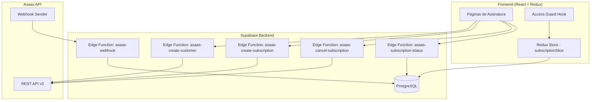
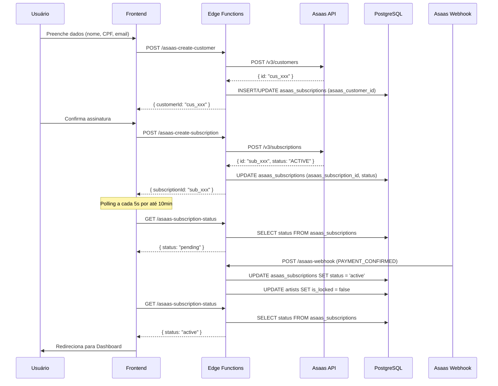
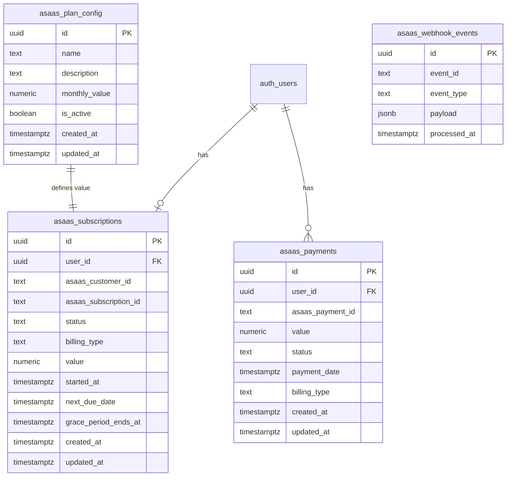

# Documento de Design: Integração de Assinatura Asaas

## Overview

Este documento descreve o design técnico para migração do sistema de monetização da plataforma Maestra, substituindo o modelo componentizado do Stripe por um plano único de assinatura recorrente via PIX, utilizando o gateway brasileiro Asaas.

### Contexto da Migração

O sistema atual utiliza Stripe com um modelo complexo de planos + componentes adicionais (artistas, membros, WhatsApp, storage). O novo modelo simplifica radicalmente: um plano único mensal via PIX que desbloqueia acesso completo a todos os módulos sem limites de artistas.

### Decisões Arquiteturais Chave

1. **Edge Functions como camada de API**: Todas as chamadas ao Asaas serão intermediadas por Edge Functions do Supabase, mantendo credenciais seguras no servidor
2. **Webhook como fonte de verdade**: O status da assinatura no banco local é atualizado exclusivamente via webhooks do Asaas, garantindo consistência
3. **Tabelas legadas preservadas**: As tabelas do Stripe (user_subscriptions, subscription_components, payment_history) permanecem intactas para auditoria
4. **Período de graça**: 72 horas de tolerância para pagamentos atrasados antes do bloqueio efetivo
5. **Polling para UX**: Verificação do status de pagamento PIX por polling a cada 5 segundos no frontend

## Architecture

### Diagrama de Componentes



### Fluxo de Assinatura



## Components and Interfaces

### 1. Edge Functions

#### `asaas-create-customer`
- **Método**: POST
- **Auth**: JWT obrigatório
- **Input**: `{ name: string, email: string, cpfCnpj: string }`
- **Output**: `{ customerId: string }`
- **Lógica**: Valida dados → verifica se cliente já existe → cria no Asaas ou reutiliza → salva `asaas_customer_id`

#### `asaas-create-subscription`
- **Método**: POST
- **Auth**: JWT obrigatório
- **Input**: `{ customerId: string }`
- **Output**: `{ subscriptionId: string, pixQrCode: string, pixCopyPaste: string, expiresAt: string }`
- **Lógica**: Busca valor do plano ativo → cria assinatura no Asaas com billingType PIX → salva `asaas_subscription_id` → retorna dados PIX da primeira cobrança

#### `asaas-cancel-subscription`
- **Método**: POST
- **Auth**: JWT obrigatório
- **Input**: `{}`
- **Output**: `{ success: boolean }`
- **Lógica**: Busca assinatura do usuário → DELETE no Asaas → atualiza status local para "cancelled"

#### `asaas-webhook`
- **Método**: POST
- **Auth**: `asaas-access-token` header
- **verify_jwt**: false (webhook externo)
- **Input**: Payload do Asaas
- **Output**: HTTP 200
- **Lógica**: Valida token → verifica idempotência → mapeia evento para status → atualiza banco

#### `asaas-subscription-status`
- **Método**: GET
- **Auth**: JWT obrigatório
- **Output**: `{ status: string, nextDueDate: string | null, value: number, gracePeriodEndsAt: string | null }`
- **Lógica**: Consulta status da assinatura do usuário no banco local

### 2. Frontend - Redux Slice (`subscriptionSlice`)

```typescript
interface SubscriptionState {
  status: 'active' | 'overdue' | 'cancelled' | 'pending' | 'none';
  asaasCustomerId: string | null;
  asaasSubscriptionId: string | null;
  nextDueDate: string | null;
  value: number | null;
  gracePeriodEndsAt: string | null;
  loading: boolean;
  error: string | null;
  pixData: {
    qrCode: string | null;
    copyPaste: string | null;
    expiresAt: string | null;
  } | null;
}
```

**Async Thunks:**
- `fetchSubscriptionStatus`: Consulta status atual
- `createAsaasCustomer`: Cria cliente no Asaas
- `createSubscription`: Cria assinatura e recebe dados PIX
- `cancelSubscription`: Cancela assinatura
- `pollPaymentStatus`: Polling para verificar confirmação

### 3. Frontend - Access Guard (`useSubscriptionGuard`)

Hook React que:
1. Lê o estado da assinatura do Redux store
2. Consulta periodicamente o status (a cada 5 minutos)
3. Aplica lógica de período de graça (72h após status "overdue")
4. Retorna `{ hasAccess: boolean, reason: string, shouldShowBanner: boolean }`
5. Redireciona para página de pagamento quando acesso é negado

### 4. Frontend - Páginas

- **SubscriptionPage**: Exibe plano, botão de assinatura, formulário de dados
- **PaymentPage**: Exibe QR Code PIX, chave copia-e-cola, countdown de expiração, polling de status
- **SubscriptionManagementPage**: Status atual, próxima cobrança, botão cancelar (integrada em Settings)

## Data Models

### Nova Tabela: `asaas_subscriptions`

| Coluna | Tipo | Constraints | Descrição |
|--------|------|-------------|-----------|
| id | uuid | PK, default gen_random_uuid() | Identificador único |
| user_id | uuid | FK auth.users, UNIQUE | Usuário proprietário |
| asaas_customer_id | text | nullable | ID do cliente no Asaas |
| asaas_subscription_id | text | nullable, unique | ID da assinatura no Asaas |
| status | text | CHECK IN ('active','overdue','cancelled','pending') | Status atual |
| billing_type | text | default 'PIX' | Tipo de cobrança |
| value | numeric(10,2) | NOT NULL | Valor mensal |
| started_at | timestamptz | nullable | Data de início |
| next_due_date | timestamptz | nullable | Próxima cobrança |
| grace_period_ends_at | timestamptz | nullable | Fim do período de graça |
| created_at | timestamptz | default now() | Criação |
| updated_at | timestamptz | default now() | Última atualização |

**RLS**: Usuário só pode ler/atualizar seu próprio registro.
**Constraint**: Apenas uma assinatura por user_id (UNIQUE em user_id).

### Nova Tabela: `asaas_payments`

| Coluna | Tipo | Constraints | Descrição |
|--------|------|-------------|-----------|
| id | uuid | PK, default gen_random_uuid() | Identificador único |
| user_id | uuid | FK auth.users | Usuário |
| asaas_payment_id | text | UNIQUE | ID do pagamento no Asaas |
| value | numeric(10,2) | NOT NULL | Valor pago |
| status | text | CHECK IN ('confirmed','received','overdue','deleted','pending') | Status |
| payment_date | timestamptz | nullable | Data do pagamento |
| billing_type | text | default 'PIX' | Tipo |
| created_at | timestamptz | default now() | Criação |
| updated_at | timestamptz | default now() | Atualização |

**RLS**: Usuário só pode ler seus próprios pagamentos.

### Nova Tabela: `asaas_plan_config`

| Coluna | Tipo | Constraints | Descrição |
|--------|------|-------------|-----------|
| id | uuid | PK, default gen_random_uuid() | Identificador |
| name | text | NOT NULL, max 100 chars | Nome do plano |
| description | text | nullable, max 500 chars | Descrição |
| monthly_value | numeric(10,2) | NOT NULL, >= 0.01 | Valor mensal |
| is_active | boolean | default true | Se está ativo |
| created_at | timestamptz | default now() | Criação |
| updated_at | timestamptz | default now() | Atualização |

**RLS**: Leitura pública, escrita apenas para admins (`platform_admins`).

### Nova Tabela: `asaas_webhook_events`

| Coluna | Tipo | Constraints | Descrição |
|--------|------|-------------|-----------|
| id | uuid | PK, default gen_random_uuid() | Identificador |
| event_id | text | UNIQUE | ID do evento Asaas (idempotência) |
| event_type | text | NOT NULL | Tipo do evento |
| payload | jsonb | NOT NULL | Payload completo |
| processed_at | timestamptz | default now() | Quando processado |

### Alterações em Tabelas Existentes

**`user_subscriptions`** (legado Stripe):
- Adicionar coluna `migrated boolean DEFAULT false`

**`subscription_components`** (legado Stripe):
- Adicionar coluna `migrated boolean DEFAULT false`

**`payment_history`** (legado Stripe):
- Adicionar coluna `migrated boolean DEFAULT false`

### Diagrama ER




## Correctness Properties

*A property is a characteristic or behavior that should hold true across all valid executions of a system — essentially, a formal statement about what the system should do. Properties serve as the bridge between human-readable specifications and machine-verifiable correctness guarantees.*

### Property 1: Idempotent Customer Creation

*For any* user that already possesses an `asaas_customer_id` stored in the database, calling the customer creation flow SHALL return the existing customer ID without making a new API call to Asaas, and the stored ID SHALL remain unchanged.

**Validates: Requirements 1.3**

### Property 2: Input Validation Rejects All Invalid Data

*For any* input where the name has fewer than 3 characters, OR the email does not match a valid email format, OR the CPF has invalid check digits (for 11-digit inputs), OR the CNPJ has invalid check digits (for 14-digit inputs), the validation function SHALL reject the input and return an error indicating the invalid field, without calling the Asaas API.

**Validates: Requirements 1.5**

### Property 3: Webhook State Machine Transitions

*For any* valid webhook payload containing a recognized event type and a subscription that exists in the database: if the event is PAYMENT_CONFIRMED or PAYMENT_RECEIVED, the subscription status SHALL become "active"; if the event is PAYMENT_OVERDUE, the status SHALL become "overdue"; if the event is SUBSCRIPTION_DELETED, SUBSCRIPTION_INACTIVATED, or PAYMENT_DELETED, the status SHALL become "cancelled".

**Validates: Requirements 3.1, 3.2, 3.3**

### Property 4: Webhook Authentication Rejects Invalid Tokens

*For any* incoming HTTP request to the webhook handler where the `asaas-access-token` header is absent or does not match the configured token, the handler SHALL respond with HTTP 401 and SHALL NOT modify any subscription state in the database.

**Validates: Requirements 3.4, 9.2, 9.3, 9.6**

### Property 5: Webhook Idempotency

*For any* webhook event that has already been processed (its event ID exists in the `asaas_webhook_events` table), reprocessing the same event SHALL return HTTP 200 and SHALL NOT alter the subscription status or insert duplicate payment history records.

**Validates: Requirements 3.6**

### Property 6: Webhook Graceful Degradation for Malformed Payloads

*For any* authenticated webhook request where the payload is missing required fields (event ID, event type, or subscription identifier) OR references a subscription not found in the database, the handler SHALL return HTTP 200, log the error, and SHALL NOT modify any subscription state.

**Validates: Requirements 3.5**

### Property 7: Active Subscription Grants Full Access

*For any* user whose subscription status is "active", the Access Guard SHALL grant access to all protected modules of the platform and SHALL permit creation of new artists without imposing any numeric limit.

**Validates: Requirements 4.1, 4.2, 5.1**

### Property 8: Inactive Subscription Blocks Access

*For any* user whose subscription status is "overdue" with grace period expired, OR "cancelled", OR absent/incomplete, the Access Guard SHALL deny access to all protected modules and redirect to the subscription/payment page.

**Validates: Requirements 4.3, 4.4, 8.3**

### Property 9: Artist Unlock on Activation

*For any* set of artists belonging to a user where `is_locked = true`, when that user's subscription transitions to "active", ALL locked artists SHALL be updated to `is_locked = false`.

**Validates: Requirements 5.2**

### Property 10: Cancelled Subscription Allows Read-Only Artist Access

*For any* user with a cancelled subscription, existing artists SHALL remain visible and queryable, but the system SHALL block creation of new artists and modification of existing artist profiles.

**Validates: Requirements 5.4**

### Property 11: Grace Period Computation

*For any* subscription that transitions to "overdue" status at timestamp T, the `grace_period_end` SHALL be set to exactly T + 72 hours, and the Access Guard SHALL grant full access for any check occurring at timestamp T' where T' < grace_period_end.

**Validates: Requirements 8.1**

### Property 12: RLS Data Isolation

*For any* authenticated user U, database queries against `asaas_subscriptions` and `asaas_payment_history` SHALL return exclusively records where `user_id` matches U's UID, regardless of how many other users' records exist in the table.

**Validates: Requirements 9.5**

## Error Handling

### Edge Functions — Estratégia de Erros

| Cenário | Código HTTP | Resposta | Ação |
|---------|-------------|----------|------|
| JWT ausente/inválido | 401 | `{ error: "Não autorizado" }` | Rejeita sem processar |
| Validação de entrada falha | 400 | `{ error: "...", field: "..." }` | Retorna campo inválido |
| Asaas API timeout (>30s) | 502 | `{ error: "Falha na comunicação com serviço de pagamento" }` | Log interno, sem expor detalhes |
| Asaas API erro de validação | 400 | `{ error: "Dados inválidos para o gateway" }` | Mapeia erro do Asaas |
| Asaas API erro de rede | 502 | `{ error: "Serviço de pagamento indisponível" }` | Log + retry sugerido ao usuário |
| Registro não encontrado | 404 | `{ error: "Recurso não encontrado" }` | — |
| Erro interno | 500 | `{ error: "Erro interno" }` | Log detalhado no servidor |

### Webhook Handler — Estratégia de Erros

- **Token inválido**: HTTP 401, sem processamento
- **Evento duplicado**: HTTP 200, sem efeito (idempotência)
- **Payload malformado**: HTTP 200, log de erro (evita reenvios desnecessários pelo Asaas)
- **Assinatura não encontrada**: HTTP 200, log de aviso
- **Erro interno do handler**: HTTP 500, log + Asaas tentará reenvio

### Frontend — Estratégia de Erros

- Erros de rede: Exibe toast com "Erro de conexão. Tente novamente."
- Erros 401: Redireciona para login
- Erros 400: Exibe mensagem específica do campo inválido no formulário
- Erros 502: Exibe "Serviço de pagamento temporariamente indisponível"
- Timeout de polling (10min sem confirmação): Exibe mensagem informando que o pagamento pode levar mais tempo e sugere verificar na próxima visita

### Access Guard — Fallback

1. Consulta banco local para status da assinatura
2. Se consulta falhar: usa cache em memória (TTL 10 min)
3. Se cache indisponível: bloqueia acesso com mensagem "Indisponibilidade temporária"
4. Nunca faz chamada síncrona à API do Asaas para verificar acesso

## Testing Strategy

### Abordagem Dual: Testes Unitários + Property-Based Testing

A estratégia de testes combina:
- **Property-Based Tests (PBT)**: Validam propriedades universais com 100+ iterações randomizadas
- **Unit Tests**: Cobrem cenários específicos, edge cases e integrações mockadas
- **Integration Tests**: Verificam fluxo end-to-end com API Asaas em sandbox

### Biblioteca PBT

- **Framework**: [fast-check](https://github.com/dubzzz/fast-check) (TypeScript, compatível com Jest)
- **Mínimo de iterações**: 100 por property test
- **Tag format**: `Feature: asaas-subscription-integration, Property {N}: {description}`

### Estrutura de Testes

```
src/
  __tests__/
    properties/
      validation.property.test.ts       # Properties 1, 2
      webhook-handler.property.test.ts  # Properties 3, 4, 5, 6
      access-guard.property.test.ts     # Properties 7, 8, 11
      artist-management.property.test.ts # Properties 9, 10
      rls-isolation.property.test.ts    # Property 12
    unit/
      asaas-customer.test.ts
      asaas-subscription.test.ts
      pix-qrcode.test.ts
      grace-period.test.ts
    integration/
      webhook-flow.test.ts
      subscription-lifecycle.test.ts
```

### Property Tests — Mapeamento

| Property | Arquivo | Generators |
|----------|---------|------------|
| 1: Idempotent Customer | validation.property.test.ts | `fc.record({ userId, existingCustomerId? })` |
| 2: Input Validation | validation.property.test.ts | `fc.record({ name: fc.string(), email: fc.string(), cpfCnpj: fc.string() })` |
| 3: State Machine | webhook-handler.property.test.ts | `fc.record({ event: fc.constantFrom(...events), subscriptionId })` |
| 4: Auth Rejection | webhook-handler.property.test.ts | `fc.record({ token: fc.string(), payload: validPayload })` |
| 5: Idempotency | webhook-handler.property.test.ts | `fc.record({ eventId: fc.uuid(), ...validPayload })` |
| 6: Malformed Payload | webhook-handler.property.test.ts | `fc.record()` com campos opcionalmente removidos |
| 7: Active Access | access-guard.property.test.ts | `fc.record({ userId, status: fc.constant('active'), module: fc.constantFrom(...modules) })` |
| 8: Inactive Block | access-guard.property.test.ts | `fc.record({ status: fc.constantFrom('overdue','cancelled','none'), gracePeriodEnd: fc.date() })` |
| 9: Artist Unlock | artist-management.property.test.ts | `fc.array(fc.record({ artistId, isLocked: fc.boolean() }))` |
| 10: Read-Only | artist-management.property.test.ts | `fc.record({ status: 'cancelled', operation: fc.constantFrom('read','create','update') })` |
| 11: Grace Period | access-guard.property.test.ts | `fc.record({ overdueTimestamp: fc.date(), checkTimestamp: fc.date() })` |
| 12: RLS | rls-isolation.property.test.ts | `fc.record({ queryingUserId, recordOwnerIds: fc.array(fc.uuid()) })` |

### Unit Tests — Cenários Principais

- Criação de customer com dados válidos (happy path)
- Criação de subscription e retorno do payment_id
- Obtenção de QR Code PIX (mock Asaas response)
- Cancelamento de assinatura (happy path + falha)
- Cálculo do período de graça (boundary: exatamente 72h)
- Polling timeout (10 minutos sem confirmação)
- Formatação de erros para o frontend

### Integration Tests

- Fluxo completo: customer → subscription → webhook confirmation → acesso ativo
- Fluxo de cancelamento: cancel request → webhook → bloqueio
- Fluxo de período de graça: overdue → 72h → bloqueio
- Webhook com replay (idempotência real)
- RLS: verificar isolamento entre usuários reais

### Configuração

```json
{
  "testFramework": "jest",
  "pbtLibrary": "fast-check",
  "minIterations": 100,
  "testEnvironment": "node",
  "integrationEnv": "supabase-sandbox + asaas-sandbox"
}
```


