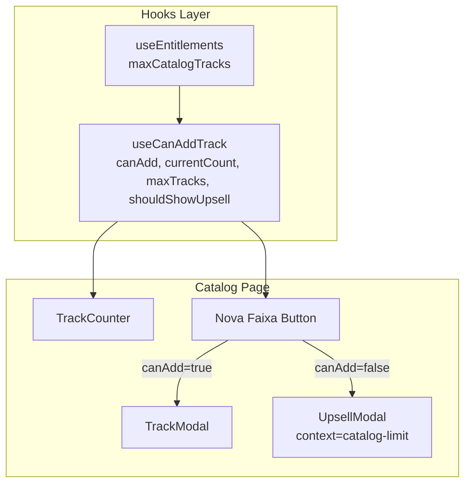
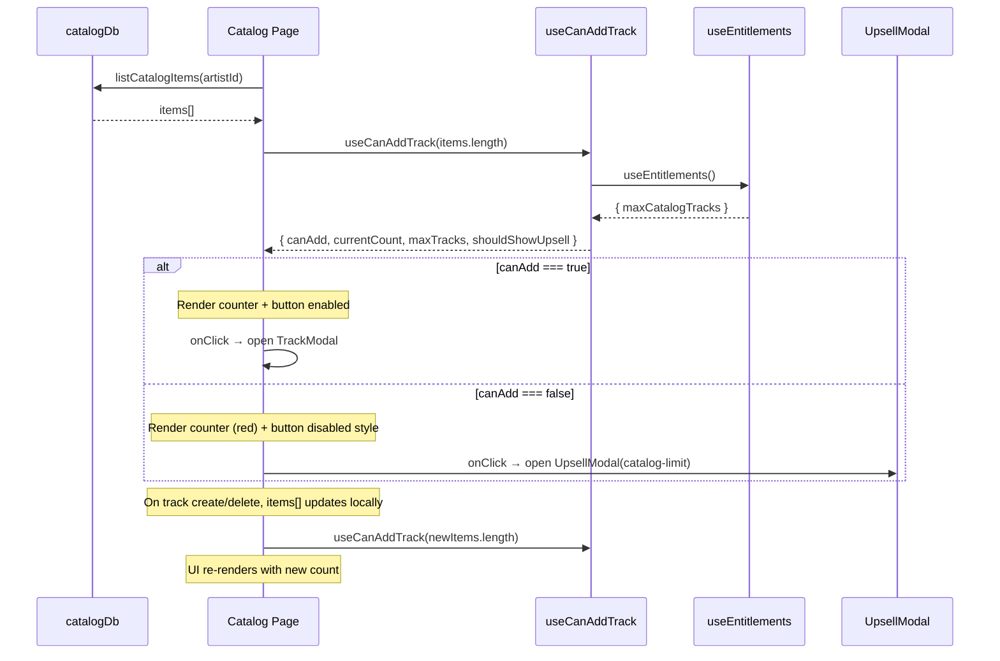

# Design Document: Catalog Track Limit

## Overview

Implementação do gate de limite de faixas manuais no catálogo para usuários do plano gratuito. O sistema reutiliza a infraestrutura de entitlements da Fase 1 (freemium-foundation) — especificamente o campo `maxCatalogTracks` do hook `useEntitlements` e o `UpsellModal` com contexto `catalog-limit` já configurado.

A arquitetura segue o mesmo padrão estabelecido por `useCanCreateArtist`: um hook derivado (`useCanAddTrack`) consome `useEntitlements`, compara o limite com a contagem atual, e retorna um resultado tipado que a UI consome para controlar renderização e interações.

## Architecture



**Decisão arquitetural**: `useCanAddTrack` recebe `currentCount` como parâmetro (não lê do Redux ou faz fetch), porque a contagem de faixas manuais é state local da Catalog Page (carregada via `catalogDb.listCatalogItems`). Isso mantém o hook puro e testável sem dependência de Redux.

## Components and Interfaces

### 1. `useCanAddTrack` Hook

**Arquivo**: `src/hooks/useCanAddTrack.ts`

```typescript
import { useMemo } from 'react';
import { useEntitlements } from './useEntitlements';

export interface CanAddTrackResult {
  /** Se true, o usuário pode criar novas faixas manuais */
  canAdd: boolean;
  /** Contagem atual de faixas manuais (passada como input) */
  currentCount: number;
  /** Limite máximo de faixas do plano (10 para free, Infinity para pro) */
  maxTracks: number;
  /** Se deve exibir o modal de upsell ao tentar criar */
  shouldShowUpsell: boolean;
}

/**
 * Hook que verifica se o usuário pode adicionar novas faixas manuais ao catálogo.
 * Segue o mesmo padrão de useCanCreateArtist.
 *
 * @param currentCount - Número atual de faixas manuais do artista
 */
export function useCanAddTrack(currentCount: number): CanAddTrackResult {
  const { maxCatalogTracks } = useEntitlements();

  return useMemo((): CanAddTrackResult => {
    if (currentCount < maxCatalogTracks) {
      return {
        canAdd: true,
        currentCount,
        maxTracks: maxCatalogTracks,
        shouldShowUpsell: false,
      };
    }
    return {
      canAdd: false,
      currentCount,
      maxTracks: maxCatalogTracks,
      shouldShowUpsell: true,
    };
  }, [currentCount, maxCatalogTracks]);
}
```

**Decisão**: o hook aceita `currentCount` como parâmetro ao invés de ler de um store global. Isso porque `items` (faixas manuais) é state local do componente Catalog, carregado via `catalogDb.listCatalogItems`. Não há slice Redux para catalog items. Essa abordagem é análoga a como `useCanCreateArtist` lê de `state.artists.items` — a diferença é que aqui o dado está em local state, não Redux.

**Lógica pura extraída para testes**:

```typescript
export function deriveCanAddTrack(
  currentCount: number,
  maxCatalogTracks: number
): CanAddTrackResult {
  if (currentCount < maxCatalogTracks) {
    return { canAdd: true, currentCount, maxTracks: maxCatalogTracks, shouldShowUpsell: false };
  }
  return { canAdd: false, currentCount, maxTracks: maxCatalogTracks, shouldShowUpsell: true };
}
```

---

### 2. `TrackCounter` Component

**Arquivo**: inline na Catalog Page (não um componente separado — é simples o suficiente)

```typescript
// Dentro de Catalog/index.tsx, no header da aba manual:
const TrackCounter: FC<{ currentCount: number; maxTracks: number }> = ({ currentCount, maxTracks }) => {
  const atLimit = currentCount >= maxTracks;
  return (
    <span
      style={{
        color: atLimit ? '#e53e3e' : '#b3b3b3',
        fontSize: 14,
        fontWeight: 600,
      }}
    >
      {currentCount}/{maxTracks} faixas
    </span>
  );
};
```

**Decisão**: componente inline (FC local) ao invés de arquivo separado. É uma renderização de 3 linhas de UI sem lógica de estado própria. Extrair para arquivo só adicionaria overhead sem ganho de reuso — o counter é específico desta página.

**Visibilidade**: renderizado apenas quando `plan === 'free'` (ou seja, `maxTracks !== Infinity`). Para Pro, o counter não aparece.

---

### 3. Modificações na Catalog Page

**Arquivo**: `src/pages/Catalog/index.tsx`

Mudanças necessárias:

1. **Import e uso do hook**:
```typescript
import { useCanAddTrack } from '../../hooks/useCanAddTrack';
import { UpsellModal } from '../../components/UpsellModal';

// Dentro do componente:
const { canAdd, currentCount, maxTracks, shouldShowUpsell } = useCanAddTrack(items.length);
const [upsellOpen, setUpsellOpen] = useState(false);
```

2. **Nova Faixa Button modificado** (no header da aba manual):
```typescript
{tab === 'manual' && (
  <div style={{ display: 'flex', alignItems: 'center', gap: 16 }}>
    {maxTracks !== Infinity && <TrackCounter currentCount={currentCount} maxTracks={maxTracks} />}
    <button
      onClick={() => {
        if (!canAdd) {
          setUpsellOpen(true);
          return;
        }
        setEditing(null);
        setModalOpen(true);
      }}
      style={{
        display: 'inline-flex',
        alignItems: 'center',
        gap: 8,
        background: '#1ed760',
        border: 'none',
        color: '#000',
        padding: '10px 20px',
        borderRadius: 9999,
        cursor: canAdd ? 'pointer' : 'not-allowed',
        fontWeight: 700,
        opacity: canAdd ? 1 : 0.5,
      }}
    >
      <FiPlus /> Nova faixa
    </button>
  </div>
)}
```

3. **UpsellModal no JSX**:
```typescript
<UpsellModal
  open={upsellOpen}
  context="catalog-limit"
  onClose={() => setUpsellOpen(false)}
/>
```

**Decisão**: a condição para mostrar o counter é `maxTracks !== Infinity` ao invés de `plan === 'free'`. Embora sejam equivalentes hoje (free → 10, pro → Infinity), usar o valor numérico diretamente é mais robusto — se no futuro existir um plano intermediário com limite de 50, o counter funcionará sem mudanças.

---

## Data Flow



**Reatividade**: quando uma faixa é criada via `onSaved`, o callback atualiza `items` (local state). Como `useCanAddTrack` recebe `items.length`, o hook recomputa automaticamente e o counter + button state atualizam sem reload.

---

## Error Handling

| Cenário | Comportamento |
|---------|---------------|
| `catalogDb.listCatalogItems` falha | `items` permanece `[]`, `currentCount=0`, `canAdd=true`. Usuário pode tentar criar — o erro aparecerá no TrackModal ao salvar. |
| `items.length` inconsistente (ex: race condition entre create e list) | O hook é reativo ao state local. Se `onSaved` atualiza `items`, a contagem reflete imediatamente. Não há gap. |
| `maxCatalogTracks` é `Infinity` (pro) e JS compara com `<` | `n < Infinity` é sempre `true` em JS para qualquer número finito. Seguro por design. |
| Usuário pro faz downgrade durante a sessão (polling atualiza status) | `useEntitlements` recomputa, `maxCatalogTracks` muda de Infinity para 10. Se user já tem >10 faixas, button fica disabled e counter mostra ex: "12/10 faixas" em vermelho. Faixas existentes NÃO são deletadas. |

---

## Testing Strategy

### Property-Based Tests (fast-check)

| Property | Gerador | Assertion |
|----------|---------|-----------|
| 1: canAdd correctness | `fc.nat(1000)` para currentCount, `fc.constantFrom(10, Infinity)` para maxTracks | `currentCount < maxTracks ⟹ canAdd===true`, `currentCount >= maxTracks ⟹ canAdd===false` |
| 2: shouldShowUpsell consistency | Mesmo gerador | `shouldShowUpsell === !canAdd` (são sempre inversos) |
| 3: Pro user never blocked | `fc.nat(10000)` para currentCount, maxTracks=Infinity | `canAdd === true` para qualquer count |
| 4: maxTracks passthrough | Qualquer input | `result.maxTracks === inputMaxTracks` (nunca transformado) |

### Unit Tests (Vitest)

- `useCanAddTrack`: boundary cases (0/10, 9/10, 10/10, 11/10), pro user (count=100, max=Infinity)
- `TrackCounter`: renders "0/10 faixas", "10/10 faixas" com red style, não renderiza para pro
- Button state: opacity e cursor conforme canAdd
- Integration: click at limit opens UpsellModal, click below limit opens TrackModal

---

## Correctness Properties

### Property 1: canAdd Derivation Correctness

*For any* non-negative integer `currentCount` and any valid `maxCatalogTracks` value (10 or Infinity), `deriveCanAddTrack` SHALL return `canAdd: true` if and only if `currentCount < maxCatalogTracks`. In all other cases (`currentCount >= maxCatalogTracks`), it SHALL return `canAdd: false`.

**Validates: Requirements 1.2, 1.3, 1.4**

### Property 2: shouldShowUpsell Inverse of canAdd

*For any* combination of `currentCount` and `maxCatalogTracks`, the property `shouldShowUpsell` SHALL always equal the logical negation of `canAdd`. There is no state where both are true or both are false.

**Validates: Requirements 1.2, 1.3**

### Property 3: Pro User Never Blocked

*For any* non-negative integer `currentCount` (including values exceeding typical limits like 10, 100, 10000), when `maxCatalogTracks` equals `Infinity`, `deriveCanAddTrack` SHALL return `canAdd: true` and `shouldShowUpsell: false`.

**Validates: Requirement 1.4**

### Property 4: maxTracks Passthrough Integrity

*For any* input values, the `maxTracks` field in the returned result SHALL exactly equal the `maxCatalogTracks` input parameter. The hook SHALL NOT transform, cap, or default this value.

**Validates: Requirement 1.5**

### Property 5: currentCount Passthrough Integrity

*For any* non-negative integer passed as `currentCount`, the returned result SHALL contain the same `currentCount` value unchanged.

**Validates: Requirement 1.1**
