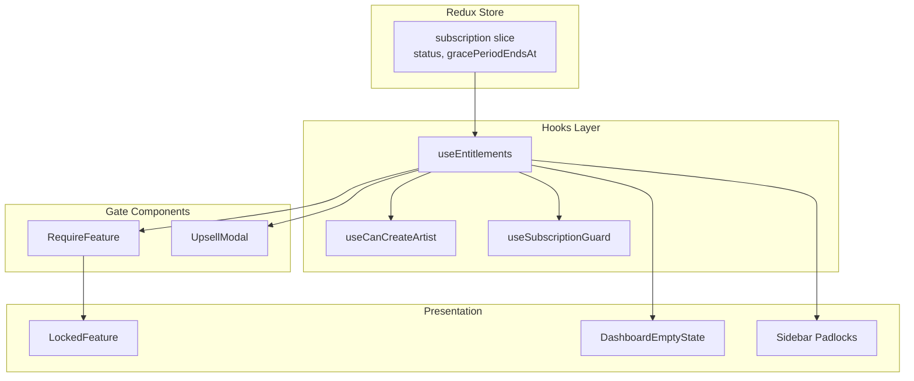
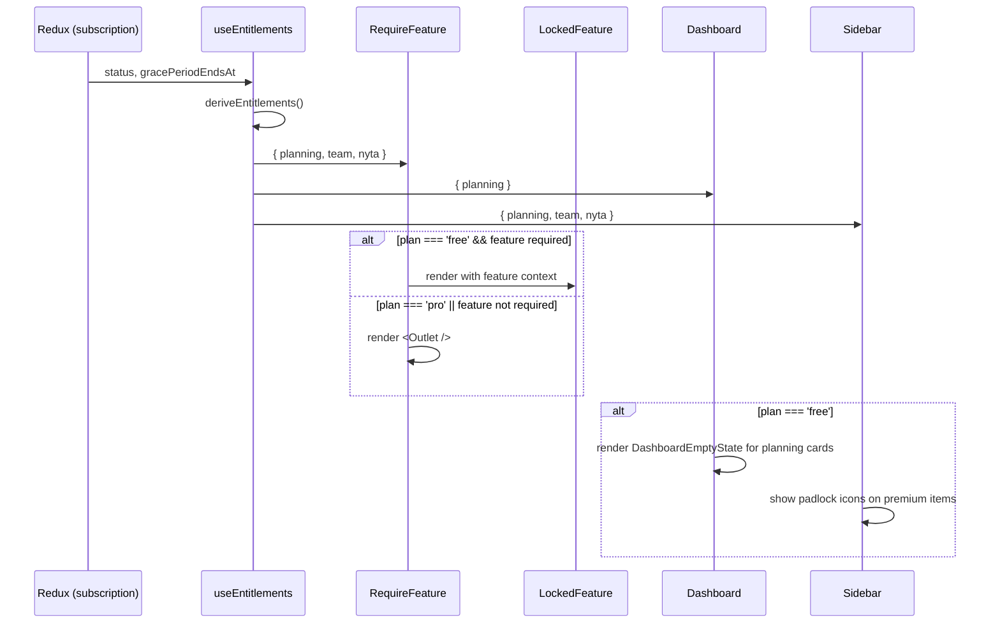

# Design Document: Freemium Foundation

## Overview

A transformação freemium substitui o modelo de bloqueio universal (`SubscriptionGuardWrapper` + `RequireOnboarding`) por um sistema de **entitlements granulares**. A arquitetura se baseia em três camadas:

1. **Camada de dados** — `useEntitlements` hook que lê `subscription` do Redux e expõe `plan`, limites numéricos e feature flags booleanos.
2. **Camada de gate** — `RequireFeature` (route-level) e `UpsellModal` (action-level) controlam acesso com base nos entitlements.
3. **Camada de apresentação** — `LockedFeature`, `DashboardEmptyState`, sidebar padlocks comunicam restrições visualmente.

A migração é **não-destrutiva**: usuários Pro não percebem mudança; usuários free (status `none`/`cancelled`/`pending`) ganham acesso ao core (artists, dashboard, catalog, agenda) e veem upsell nos módulos premium.

## Architecture



**Decisão arquitetural**: `useEntitlements` é a **única fonte de verdade** para derivação de plano. Todos os outros hooks e componentes que precisam de informação de plano consomem `useEntitlements` — nunca lêem `subscription` do Redux diretamente para decisões de acesso.

## Components and Interfaces

### 1. `useEntitlements` Hook

**Arquivo**: `src/hooks/useEntitlements.ts`

```typescript
export type Plan = 'free' | 'pro';

export type FeatureKey = 'planning' | 'team' | 'nyta';

export interface Entitlements {
  plan: Plan;
  maxArtists: number;         // 1 (free) | Infinity (pro)
  maxCatalogTracks: number;   // 10 (free) | Infinity (pro)
  planning: boolean;
  team: boolean;
  nyta: boolean;
}

export function useEntitlements(): Entitlements;
```

**Lógica de derivação** (pura, testável isoladamente):

```typescript
export function deriveEntitlements(
  status: SubscriptionState['status'],
  gracePeriodEndsAt: string | null,
  now: number = Date.now()
): Entitlements {
  if (PAYWALL_DISABLED) {
    return {
      plan: 'pro',
      maxArtists: Infinity,
      maxCatalogTracks: Infinity,
      planning: true,
      team: true,
      nyta: true,
    };
  }

  const isPro =
    status === 'active' ||
    (status === 'overdue' &&
      gracePeriodEndsAt !== null &&
      now < new Date(gracePeriodEndsAt).getTime());

  return {
    plan: isPro ? 'pro' : 'free',
    maxArtists: isPro ? Infinity : 1,
    maxCatalogTracks: isPro ? Infinity : 10,
    planning: isPro,
    team: isPro,
    nyta: isPro,
  };
}
```

**Memoização**: o hook usa `useMemo` com deps `[status, gracePeriodEndsAt]`. A função `deriveEntitlements` é exportada separadamente para testes unitários e property-based testing sem necessidade de renderizar hooks React.

**Decisão**: expor `deriveEntitlements` como função pura permite testá-la com qualquer combinação de inputs sem overhead de React. O hook `useEntitlements` é apenas o wrapper que lê do Redux e chama `deriveEntitlements`.

---

### 2. `RequireFeature` Component

**Arquivo**: `src/components/RequireFeature.tsx`

```typescript
import { FC } from 'react';
import { Outlet } from 'react-router-dom';
import { useEntitlements, FeatureKey } from '../hooks/useEntitlements';
import { LockedFeature } from './LockedFeature';

interface RequireFeatureProps {
  feature: FeatureKey;
}

export const RequireFeature: FC<RequireFeatureProps> = ({ feature }) => {
  const entitlements = useEntitlements();
  
  if (entitlements[feature]) {
    return <Outlet />;
  }
  
  return <LockedFeature feature={feature} />;
};
```

**Padrão de uso no Route tree**: como React Router layout route com `<Outlet />`:

```tsx
<Route element={<RequireFeature feature="planning" />}>
  <Route path="/artists/:id/wizard/*" element={<Wizard />} />
  <Route path="/artists/:id/action-plan" element={<ActionPlan />} />
</Route>
```

**Decisão**: usar `<Outlet />` (não `children`) porque é o padrão de layout routes do React Router 6 — permite agrupar múltiplas rotas sob o mesmo gate sem prop drilling.

---

### 3. `LockedFeature` Component

**Arquivo**: `src/components/LockedFeature/index.tsx`

```typescript
import { FC } from 'react';
import { useNavigate } from 'react-router-dom';
import { FeatureKey } from '../../hooks/useEntitlements';

interface LockedFeatureProps {
  feature: FeatureKey;
}

export const LockedFeature: FC<LockedFeatureProps> = ({ feature }) => {
  // ...
};
```

**Configuração por módulo** — objeto estático (não prop):

```typescript
// src/components/LockedFeature/config.ts
import { FiTarget, FiUsers, FiTrendingUp } from 'react-icons/fi';
import { FeatureKey } from '../../hooks/useEntitlements';

interface LockedFeatureConfig {
  icon: React.ComponentType;
  title: string;
  benefits: [string, string, string]; // exatamente 3
  gradient: string; // CSS linear-gradient
}

export const LOCKED_FEATURE_CONFIG: Record<FeatureKey, LockedFeatureConfig> = {
  planning: {
    icon: FiTarget,
    title: 'Planejamento Estratégico',
    benefits: [
      'Diagnóstico completo da carreira com IA',
      'Plano de ação personalizado com metas e tarefas',
      'Acompanhamento contínuo de progresso e métricas',
    ],
    gradient: 'linear-gradient(135deg, #1a1a2e 0%, #16213e 50%, #0f3460 100%)',
  },
  team: {
    icon: FiUsers,
    title: 'Gestão de Equipe',
    benefits: [
      'Convide membros com níveis de acesso granulares',
      'Gerencie permissões por módulo (catálogo, agenda, finanças)',
      'Colabore com produtores, managers e distribuidoras',
    ],
    gradient: 'linear-gradient(135deg, #1a1a2e 0%, #1e3a2e 50%, #0f4630 100%)',
  },
  nyta: {
    icon: FiTrendingUp,
    title: 'Nyta — Análise de Mercado',
    benefits: [
      'Relatórios semanais de performance com benchmarks',
      'Monitoramento de concorrentes e tendências',
      'Recomendações personalizadas por IA',
    ],
    gradient: 'linear-gradient(135deg, #1a1a2e 0%, #2e1a3a 50%, #3d0f60 100%)',
  },
};
```

**Layout da tela**: página completa (ocupa todo o espaço do `<Outlet />`):

```
┌──────────────────────────────────────────┐
│ [gradient background]                     │
│                                           │
│         [icon - 48px, color #1ed760]      │
│         [title - h1, branco]              │
│                                           │
│    ✓ Benefit 1                            │
│    ✓ Benefit 2                            │
│    ✓ Benefit 3                            │
│                                           │
│    ┌─────────────────────────┐            │
│    │  Assinar Maestra Pro    │ (btn)      │
│    └─────────────────────────┘            │
│                                           │
└──────────────────────────────────────────┘
```

**Decisão**: configuração como constante (não fetch/prop) — o conteúdo de benefits é fixo por módulo e raramente muda. Evita round-trips e simplifica o componente.

---

### 4. `UpsellModal` Component

**Arquivo**: `src/components/UpsellModal/index.tsx`

```typescript
import { FC } from 'react';
import { Modal } from 'antd';

export type UpsellContext = 'artist-limit' | 'catalog-limit';

interface UpsellModalProps {
  open: boolean;
  context: UpsellContext;
  onClose: () => void;
}

export const UpsellModal: FC<UpsellModalProps> = ({ open, context, onClose }) => {
  // ...
};
```

**Configuração por contexto**:

```typescript
// src/components/UpsellModal/config.ts
interface UpsellConfig {
  title: string;
  description: string;
  benefits: string[];
  icon: React.ComponentType;
}

export const UPSELL_CONFIG: Record<UpsellContext, UpsellConfig> = {
  'artist-limit': {
    title: 'Limite de artistas atingido',
    description: 'No plano gratuito, você pode gerenciar 1 artista. Assine o Pro para adicionar artistas ilimitados.',
    benefits: [
      'Artistas ilimitados',
      'Planejamento estratégico com IA',
      'Gestão de equipe colaborativa',
    ],
    icon: FiUser,
  },
  'catalog-limit': {
    title: 'Limite de faixas atingido',
    description: 'No plano gratuito, você pode cadastrar até 10 faixas. Assine o Pro para catálogo ilimitado.',
    benefits: [
      'Catálogo ilimitado',
      'Splits e contratos automatizados',
      'Relatórios de royalties detalhados',
    ],
    icon: FiMusic,
  },
};
```

**Decisão**: usar `antd Modal` ao invés de custom — mantém consistência com o design system existente, herda dark theme via ConfigProvider, e fornece acessibilidade (focus trap, escape key) gratuitamente.

**Layout do modal**:
- Header: ícone + título
- Body: descrição + lista de benefits + preço (R$ 49,90/mês)
- Footer: botão primário "Assinar Maestra Pro" → navega `/assinatura`, botão ghost "Agora não" → `onClose()`

---

### 5. `useCanCreateArtist` (Refatorado)

**Arquivo**: `src/hooks/useCanCreateArtist.ts`

```typescript
import { useMemo } from 'react';
import { useAppSelector } from '../store/store';
import { useEntitlements } from './useEntitlements';

export interface CanCreateArtistResult {
  canCreate: boolean;
  reason: string | null;
  shouldShowUpsell: boolean;  // renomeado de shouldRedirectToSubscription
}

export function useCanCreateArtist(): CanCreateArtistResult {
  const { maxArtists } = useEntitlements();
  const artists = useAppSelector((s) => s.artists.items);

  return useMemo((): CanCreateArtistResult => {
    if (artists.length < maxArtists) {
      return { canCreate: true, reason: null, shouldShowUpsell: false };
    }
    return {
      canCreate: false,
      reason: 'Limite de artistas do plano gratuito atingido.',
      shouldShowUpsell: true,
    };
  }, [artists.length, maxArtists]);
}
```

**Decisão**: a lógica agora é **numérica** (`artists.length < maxArtists`) em vez de case-by-case no status. Toda a complexidade de grace period e status fica encapsulada em `useEntitlements`. O campo `shouldRedirectToSubscription` é renomeado para `shouldShowUpsell` pois no modelo freemium não há mais redirect — há modal.

---

### 6. `useSubscriptionGuard` (Refatorado)

**Arquivo**: `src/hooks/useSubscriptionGuard.ts`

O hook mantém sua responsabilidade de **polling** e **caching**, mas delega a computação de acesso ao `useEntitlements`:

```typescript
export function useSubscriptionGuard(
  options: UseSubscriptionGuardOptions = {}
): SubscriptionGuardResult {
  const { skipRedirect = false } = options;
  const { plan } = useEntitlements();
  
  // ... polling e caching permanecem iguais ...
  
  const result = useMemo((): SubscriptionGuardResult => {
    return {
      hasAccess: plan === 'pro',
      reason: plan === 'pro' ? 'Assinatura ativa' : 'Plano gratuito',
      shouldShowBanner: status === 'overdue' && plan === 'pro', // grace period
    };
  }, [plan, status]);

  // Remove o redirect automático — não é mais necessário no modelo freemium.
  // O componente RequireFeature cuida do gate nas rotas premium.
  
  return result;
}
```

**Decisão**: manter o hook (não deletar) pois o polling/caching de `fetchSubscriptionStatus` continua necessário — o status precisa ser atualizado periodicamente. Mas remove-se o **redirect automático** que era core do modelo antigo.

---

### 7. `DashboardEmptyState` Component

**Arquivo**: `src/components/DashboardEmptyState/index.tsx`

```typescript
import { FC } from 'react';
import { useNavigate } from 'react-router-dom';

interface DashboardEmptyStateProps {
  title: string;
  description: string;
}

export const DashboardEmptyState: FC<DashboardEmptyStateProps> = ({
  title,
  description,
}) => {
  const navigate = useNavigate();

  return (
    <div className="dashboard-empty-state">
      <h3>{title}</h3>
      <p>{description}</p>
      <button onClick={() => navigate('/assinatura')}>Assinar Pro</button>
    </div>
  );
};
```

**Uso no Dashboard**: o Dashboard lê `useEntitlements()` e condicionalmente renderiza `DashboardEmptyState` para os cards de planejamento quando `planning === false`:

```typescript
const { planning } = useEntitlements();

// No JSX:
{planning ? (
  <PlanningCards strategies={artist.content.strategies} />
) : (
  <DashboardEmptyState
    title="Plano de Ação"
    description="Crie estratégias personalizadas com IA para impulsionar sua carreira."
  />
)}
```

---

### 8. Sidebar Padlock Indicators

**Modificação em**: `src/components/Layout/components/Sidebar/index.tsx`

**Abordagem**: adicionar prop `locked` ao `NavItem` existente. Quando `locked === true`, renderiza um ícone `FiLock` (12px, `#b3b3b3`) à direita do label.

```typescript
// Dentro do Sidebar, consumir useEntitlements:
const { planning, team, nyta } = useEntitlements();

// No array modules, adicionar campo locked:
const modules = [
  { icon: <FiGrid />, label: 'Dashboard', suffix: '', locked: false },
  { icon: <FiTarget />, label: 'Plano de Ação', suffix: 'action-plan', locked: !planning },
  { icon: <FiMusic />, label: 'Catálogo', suffix: 'catalog', locked: false },
  { icon: <FiCalendar />, label: 'Agenda', suffix: 'agenda', locked: false },
  { icon: <FiUsers />, label: 'Equipe', suffix: 'team', locked: !team },
  { icon: <FiUser />, label: 'Perfil', suffix: 'profile', locked: false },
];
```

**NavItem** modificado:

```typescript
const NavItem: FC<{
  icon: React.ReactNode;
  label: string;
  active?: boolean;
  collapsed?: boolean;
  locked?: boolean;
  onClick: () => void;
}> = ({ icon, label, active, collapsed, locked, onClick }) => (
  <button onClick={onClick} /* ... */>
    <span style={{ fontSize: 20, display: 'flex' }}>{icon}</span>
    {!collapsed && <span>{label}</span>}
    {!collapsed && locked && (
      <FiLock style={{ fontSize: 12, color: '#b3b3b3', marginLeft: 'auto' }} />
    )}
  </button>
);
```

**Decisão**: o padlock **não bloqueia navegação** — clicar leva à rota normalmente, e o `RequireFeature` exibe a tela de locked. Isso mantém single responsibility e evita duplicação de lógica.

---

## Data Flow



**Propagação de mudanças**: quando `subscription.status` muda no Redux (ex: polling detecta pagamento confirmado), todos os componentes que usam `useEntitlements` re-renderizam automaticamente via `useAppSelector`. Não há necessidade de refresh ou event bus.

---

## Route Architecture

### Nova Árvore de Rotas (App.tsx)

```tsx
const AppRoutes: FC = () => {
  return (
    <Routes>
      <Route path='/login' element={<PublicOnly><Login /></PublicOnly>} />
      <Route path='/signup' element={<PublicOnly><Signup /></PublicOnly>} />

      <Route element={<RequireAuth />}>
        <Route element={<AppLayout />}>
          <Route path='/' element={<Navigate to='/artists' replace />} />

          {/* ── Rotas livres (free + pro) ── */}
          <Route path='/artists' element={<Artists />} />
          <Route path='/artists/:id' element={<Dashboard />} />
          <Route path='/artists/:id/catalog' element={<Catalog />} />
          <Route path='/artists/:id/agenda' element={<Agenda />} />
          <Route path='/artists/:id/profile' element={<Profile />} />

          {/* ── Rotas premium — gate por feature ── */}
          <Route element={<RequireFeature feature="planning" />}>
            <Route path='/artists/:id/wizard/*' element={<Wizard />} />
            <Route path='/artists/:id/action-plan' element={<ActionPlan />} />
          </Route>

          <Route element={<RequireFeature feature="team" />}>
            <Route path='/artists/:id/team' element={<Team />} />
          </Route>

          {/* ── Rotas sem gate (infra) ── */}
          <Route path='/assinatura' element={<SubscriptionPage />} />
          <Route path='/pagamento' element={<PaymentPage />} />
          <Route path='/notifications' element={<Notifications />} />
          <Route path='/settings' element={<Settings />} />

          <Route element={<RequireAdmin />}>
            <Route path='/admin/knowledge-base' element={<AdminKnowledgeBase />} />
          </Route>

          <Route path='*' element={<Page404 />} />
        </Route>
      </Route>
    </Routes>
  );
};
```

**O que muda vs. atual**:

| Antes | Depois |
|-------|--------|
| `<SubscriptionGuardWrapper>` envolve artists, wizard, dashboard, catalog, agenda, team, profile | Removido — rotas livres ficam sem wrapper |
| `<RequireOnboarding>` envolve dashboard, action-plan, catalog, agenda, team, profile | Removido — dashboard/catalog/agenda acessíveis sem onboarding |
| Wizard fora do RequireOnboarding | Wizard dentro de `<RequireFeature feature="planning">` |
| Team dentro do RequireOnboarding | Team dentro de `<RequireFeature feature="team">` |

---

## Data Models

### Entitlements (derivado, não persistido)

```typescript
interface Entitlements {
  plan: 'free' | 'pro';
  maxArtists: number;
  maxCatalogTracks: number;
  planning: boolean;
  team: boolean;
  nyta: boolean;
}
```

Não há mudanças no schema do banco. O modelo de entitlements é **client-side only**, derivado do `subscription.status` existente. Os limites numéricos (1 artista, 10 faixas) devem também ser enforced server-side nas Edge Functions para segurança, mas esse enforcement server-side está fora do escopo desta fase (frontend-only).

### SubscriptionState (existente, sem mudanças)

```typescript
interface SubscriptionState {
  status: 'active' | 'overdue' | 'cancelled' | 'pending' | 'none';
  gracePeriodEndsAt: string | null;
  // ... demais campos mantidos
}
```

---

## Correctness Properties

*A property is a characteristic or behavior that should hold true across all valid executions of a system — essentially, a formal statement about what the system should do. Properties serve as the bridge between human-readable specifications and machine-verifiable correctness guarantees.*

### Property 1: Plan Derivation Correctness

*For any* subscription status and grace period configuration, `deriveEntitlements` SHALL return `plan: 'pro'` if and only if status is `active` OR (status is `overdue` AND current time is before `gracePeriodEndsAt`). In all other cases, it SHALL return `plan: 'free'`.

**Validates: Requirements 1.1, 1.2, 1.3**

### Property 2: PAYWALL_DISABLED Override

*For any* subscription state (any combination of status and gracePeriodEndsAt), when `PAYWALL_DISABLED` is `true`, `deriveEntitlements` SHALL return `plan: 'pro'` with `maxArtists: Infinity`, `maxCatalogTracks: Infinity`, and all feature flags (`planning`, `team`, `nyta`) as `true`.

**Validates: Requirements 1.4**

### Property 3: Entitlement Field Consistency

*For any* subscription state, all entitlement fields SHALL be consistent with the derived plan: if `plan === 'pro'` then `maxArtists === Infinity AND maxCatalogTracks === Infinity AND planning === true AND team === true AND nyta === true`; if `plan === 'free'` then `maxArtists === 1 AND maxCatalogTracks === 10 AND planning === false AND team === false AND nyta === false`.

**Validates: Requirements 1.5, 1.6, 1.7, 1.8, 1.9**

### Property 4: RequireFeature Gate Correctness

*For any* feature key (`planning`, `team`, `nyta`) and any entitlements object, `RequireFeature` SHALL render children (Outlet) if and only if `entitlements[feature] === true`. Otherwise it SHALL render `LockedFeature` with the same feature key.

**Validates: Requirements 3.1, 3.2**

### Property 5: Sidebar Padlock Consistency

*For any* derived plan, the sidebar SHALL display padlock icons on premium menu items if and only if the corresponding feature entitlement is `false`. When all feature entitlements are `true`, no padlock icons SHALL be displayed.

**Validates: Requirements 8.1, 8.2**

---

## Error Handling

| Cenário | Comportamento |
|---------|---------------|
| `subscription.error` (fetch falhou) | `useEntitlements` usa o último `status` conhecido no Redux. Se `status === 'none'` (nunca carregou), assume `free`. Não bloqueia acesso ao core. |
| `gracePeriodEndsAt` é `null` com status `overdue` | Trata como grace expirado → `free`. Defensivo contra dados incompletos. |
| Componente `RequireFeature` recebe `feature` inválido | TypeScript impede em compile-time (tipo `FeatureKey` é union literal). Em runtime, fallback para `LockedFeature`. |
| `artists` array vazio no `useCanCreateArtist` | `0 < maxArtists` é `true` → permite criação. Correto por design. |
| Polling falha repetidamente | Cache TTL de 10 min mantém último status bom. Após TTL expirar, fallback para `free` (fail-safe, não fail-open). |

---

## Testing Strategy

### Property-Based Tests (fast-check)

Usar **fast-check** como biblioteca PBT. Cada property test roda **mínimo 100 iterações**.

| Property | Gerador | Assertion |
|----------|---------|-----------|
| 1: Plan Derivation | `fc.record({ status: fc.constantFrom('active','overdue','cancelled','pending','none'), gracePeriodEndsAt: fc.option(fc.date()), now: fc.nat() })` | Verifica regra de derivação completa |
| 2: PAYWALL_DISABLED | Mesmo gerador + flag `true` | Sempre retorna pro com tudo desbloqueado |
| 3: Field Consistency | Qualquer input para `deriveEntitlements` | Todos os campos derivados são consistentes com o plan |
| 4: RequireFeature Gate | `fc.constantFrom('planning','team','nyta')` + entitlements gerado | Render correto baseado no entitlement boolean |
| 5: Sidebar Padlock | Entitlements gerado | Padlock IFF feature===false |

**Tag format**: `// Feature: freemium-foundation, Property N: <title>`

### Unit Tests (Vitest)

- `useCanCreateArtist`: cenários específicos (0 artists/free, 1 artist/free, N artists/pro)
- `LockedFeature`: renders com cada feature context, verifica 3 benefits e CTA
- `UpsellModal`: open/close, navigation, content por context
- `Dashboard`: empty state para free, dados para pro
- Route integration: free user acessa /artists, /catalog sem bloqueio

### Integration Tests

- Navegação completa: free user → rota premium → vê LockedFeature → clica CTA → vai para /assinatura
- Subscription state change: simula polling que muda status `none` → `active` → componentes re-renderizam sem reload

---

## Styling Strategy

**Abordagem**: SCSS modules para novos componentes, inline styles removidos progressivamente.

| Componente | Arquivo de estilo |
|------------|-------------------|
| LockedFeature | `src/components/LockedFeature/LockedFeature.module.scss` |
| UpsellModal | `src/components/UpsellModal/UpsellModal.module.scss` |
| DashboardEmptyState | `src/components/DashboardEmptyState/DashboardEmptyState.module.scss` |
| Sidebar (padlock) | Modificação inline no NavItem existente (minimal) |

**Tokens de design respeitados**:
- Background: `#121212` (base), `#181818` (elevated), `#282828` (hover)
- Text: `#fff` (primary), `#b3b3b3` (secondary), `#6b7280` (muted)
- Accent: `#1ed760` (primary CTA), `rgba(30, 215, 96, 0.1)` (hover bg)
- Border radius: `8px` (cards), `24px` (buttons pill), `50%` (avatars)
- Font: `SpotifyMixUI` (body), `SpotifyMixUITitle` (headings)

---

## Migration Path

### Estratégia de Deploy

A migração é **feature-flag safe**: o `PAYWALL_DISABLED` existente já garante que em dev/staging tudo funciona como pro. A transição para produção é:

1. **Deploy code changes** — as mudanças de rota e componentes vão para produção.
2. **Nenhuma migration de dados** — o modelo freemium é inteiramente derivado do `subscription.status` existente.
3. **Impacto por tipo de usuário**:
   - **Pro (status=active/overdue em grace)**: zero mudança comportamental. Routes que antes eram acessíveis continuam acessíveis. Não veem padlocks, não veem empty states.
   - **Free (status=none/cancelled/pending)**: antes eram bloqueados em `/assinatura`. Agora veem artists + dashboard + catalog + agenda. Rotas premium mostram LockedFeature.
   - **Overdue (grace expirado)**: comportamento muda de redirect global → acesso ao core + gate nos premium.

### Checklist de Remoção

- [x] Remove `SubscriptionGuardWrapper` do route tree
- [x] Remove `RequireOnboarding` do route tree (wrapping dashboard/catalog/agenda)
- [x] Remove redirect automático do `useSubscriptionGuard`
- [x] Remove lógica de status switch do `useCanCreateArtist` (substituir por `useEntitlements`)
- [ ] (Futuro) Remove `useSubscriptionGuard` inteiramente se polling for migrado para `useEntitlements`

### Backward Compatibility

- `useSubscriptionGuard` continua exportado com a mesma interface `SubscriptionGuardResult` — componentes que o usam (ex: `GracePeriodBanner`, `AnnouncementBanner`) continuam funcionando.
- `PAYWALL_DISABLED` continua respeitado — agora vive dentro de `deriveEntitlements` em vez de espalhado por múltiplos hooks.
- O `AnnouncementBanner` (footer upsell) permanece inalterado — ele já é independente do guard.
