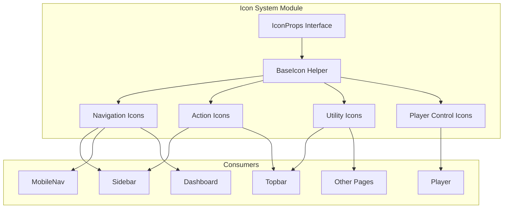

# Design Document: Icon System Replacement

## Overview

This design defines the architecture for replacing all external `react-icons` usage with a centralized, self-contained SVG icon system in the Maestra 2.0 application. The existing `src/components/Icons/index.tsx` module already contains custom SVG icons for player controls but lacks a consistent API — icons have hardcoded colors, no props interface, and separate Active/Inactive variants.

The new system introduces a shared `IconProps` interface that all icon components accept, enabling dynamic sizing and coloring without variant duplication. This eliminates the `react-icons` dependency (~150KB parsed, tree-shaken but still adds module resolution overhead) and gives the team full control over SVG optimization and accessibility attributes.

### Key Design Decisions

1. **Single module, named exports** — All icons live in `src/components/Icons/index.tsx` (existing location). No subdirectories or barrel re-exports needed given the module size (~40 icons).
2. **Props over variants** — Instead of `HomeIcon` + `ActiveHomeIcon`, a single `HomeIcon` accepts `color` prop. Removes 1:1 duplication.
3. **`currentColor` default** — Icons inherit text color from parent by default, making them work naturally in styled containers without explicit color props.
4. **`fast-check` for property tests** — Already installed as a dev dependency. Tests will verify the icon component contract across random inputs.

## Architecture



### Migration Strategy

The migration proceeds in three phases:

1. **Phase 1: Refactor Icons module** — Add `IconProps` interface, refactor existing icons to accept props, remove `Active*` variants.
2. **Phase 2: Create missing icons** — Implement all Feather-equivalent SVG icons needed by Sidebar, Topbar, MobileNav, Dashboard.
3. **Phase 3: Migrate consumers** — Update all importing components to use the new icon components with appropriate `size` and `color` props, then remove `react-icons` from `package.json`.

## Components and Interfaces

### IconProps Interface

```typescript
import { SVGProps } from 'react';

export interface IconProps extends SVGProps<SVGSVGElement> {
  /** Icon width and height in pixels. Default: 24 */
  size?: number;
  /** SVG fill color. Default: 'currentColor' */
  color?: string;
  /** Additional CSS class name applied to the root <svg> element */
  className?: string;
}
```

All standard SVG attributes are inherited via `SVGProps<SVGSVGElement>`, allowing consumers to pass `style`, `onClick`, `data-*`, or any other valid SVG attribute.

### Icon Component Pattern

Each icon follows this structure:

```typescript
export const GridIcon: FC<IconProps> = ({
  size = 24,
  color = 'currentColor',
  className,
  ...rest
}) => (
  <svg
    width={size}
    height={size}
    viewBox="0 0 24 24"
    fill={color}
    stroke={color}
    strokeWidth="0"
    role="img"
    aria-hidden="true"
    focusable="false"
    className={className}
    {...rest}
  >
    <path d="M..."/>
  </svg>
);
```

### Icon Inventory

| Category | Icons | Used By |
|----------|-------|---------|
| Navigation | `GridIcon`, `HomeIcon`, `SearchIcon`, `LibraryIcon`, `AlbumIcon`, `BrowseIcon` | Sidebar, MobileNav |
| Growth | `ActivityIcon`, `TargetIcon`, `CheckSquareIcon` | Sidebar, MobileNav, Dashboard |
| Operations | `MusicIcon`, `CalendarIcon`, `UsersIcon` | Sidebar, Dashboard |
| Actions | `ChevronLeftIcon`, `ChevronRightIcon`, `PlusIcon`, `LockIcon`, `DatabaseIcon`, `MessageCircleIcon` | Sidebar, various |
| Topbar | `BellIcon`, `SettingsIcon`, `LogOutIcon` | Topbar |
| Utility | `ArrowRightIcon`, `ArrowLeftIcon`, `TrashIcon`, `UploadCloudIcon`, `AlertCircleIcon`, `DownloadIcon` | Various pages |
| Player Controls | `ShuffleIcon`, `SkipBack`, `SkipNext`, `Replay`, `Play`, `Pause`, `VolumeIcon`, etc. | Player (existing) |

### Consumer Migration Pattern

**Before (Sidebar):**
```typescript
import { FiGrid, FiActivity } from 'react-icons/fi';

// In NavItem:
<span style={{ fontSize: 20 }}>{icon}</span>
// Color controlled via parent style
```

**After (Sidebar):**
```typescript
import { GridIcon, ActivityIcon } from '../../Icons';

// In groups definition:
{ icon: <GridIcon size={20} color={active ? '#ffffff' : '#b3b3b3'} />, ... }
```

The `NavItem` component will pass `color` based on its `active` prop directly to the icon, eliminating the need for CSS-based color inheritance via `fontSize` span wrappers.

### Context-Specific Sizing

| Context | Size | Rationale |
|---------|------|-----------|
| Sidebar | 20px | Compact navigation, matches current `fontSize: 20` on icon span |
| MobileNav | 24px | Touch targets need larger icons for mobile usability |
| Topbar | 18px | Smaller utility actions in dense horizontal bar |
| Player Controls | em-based via style | Existing player uses relative sizing (`1.15em`, `1.2em`) for responsive behavior |

## Data Models

No persistent data models are involved. The icon system is purely presentational with no state management, API calls, or storage.

### Type Definitions

```typescript
// src/components/Icons/index.tsx

export interface IconProps extends SVGProps<SVGSVGElement> {
  size?: number;
  color?: string;
  className?: string;
}

// All icons: FC<IconProps>
// Player controls retain their existing prop patterns (active: boolean)
// but ALSO accept IconProps for size/color when used outside player context
```

## Correctness Properties

*A property is a characteristic or behavior that should hold true across all valid executions of a system — essentially, a formal statement about what the system should do. Properties serve as the bridge between human-readable specifications and machine-verifiable correctness guarantees.*

### Property 1: Size prop determines rendered dimensions

*For any* numeric size value between 1 and 512, when passed to any Icon_Component, the rendered SVG element SHALL have both `width` and `height` attributes equal to that size value.

**Validates: Requirements 1.3, 4.5**

### Property 2: Color prop determines fill attribute

*For any* valid CSS color string passed as the `color` prop to any Icon_Component, the rendered SVG element SHALL have its `fill` attribute set to that exact color string.

**Validates: Requirements 1.4, 3.1, 3.2**

### Property 3: className prop is forwarded to SVG element

*For any* non-empty string passed as the `className` prop to any Icon_Component, the rendered SVG element SHALL include that string in its `class` attribute.

**Validates: Requirements 1.8**

### Property 4: All icons render with correct default accessibility attributes

*For any* Icon_Component rendered without explicit accessibility overrides, the SVG element SHALL have `role="img"`, `aria-hidden="true"`, and `focusable="false"` attributes present.

**Validates: Requirements 2.9, 6.1, 6.4**

### Property 5: aria-label prop renders when provided

*For any* string of length ≥ 2 passed as the `aria-label` prop to any Icon_Component, the rendered SVG element SHALL have that string as its `aria-label` attribute value.

**Validates: Requirements 6.2**

### Property 6: SVG optimization invariants

*For any* Icon_Component rendered with any valid props, the output SHALL contain exactly one `<svg>` element (no nested SVGs), SHALL have `viewBox="0 0 24 24"`, SHALL NOT contain `xmlns`, `xml:space`, `data-name`, or editor metadata attributes, and the total rendered markup SHALL be ≤ 1024 characters.

**Validates: Requirements 7.1, 7.2, 7.3, 7.5**

## Error Handling

| Scenario | Behavior |
|----------|----------|
| `size` prop is 0 or negative | Clamp to minimum of 1. Render at 1×1 rather than crashing. |
| `size` prop exceeds 512 | Clamp to maximum of 512. Log dev warning. |
| `color` prop is empty string | Fall back to `currentColor` default. |
| Icon used as sole interactive element without `aria-label` | Log `console.warn` in development mode only (check `process.env.NODE_ENV !== 'production'`). Still renders the icon. |
| Unknown props passed via `...rest` | Forward to `<svg>` element. React handles invalid SVG attributes with its own warnings. |
| Missing icon import (post-migration) | TypeScript compilation error. Build fails clearly with module not found. |

## Testing Strategy

### Unit Tests (Example-Based)

- **Default props**: Verify each icon renders at 24×24 with `currentColor` fill when no props given
- **Active/Inactive states**: Verify Sidebar NavItem passes `#ffffff` when active, `#b3b3b3` when inactive
- **Context sizing**: Verify Sidebar passes `size={20}`, MobileNav `size={24}`, Topbar `size={18}`
- **Accessibility warning**: Verify `console.warn` fires when icon used standalone without `aria-label`
- **No Active* variants**: Verify `ActiveHomeIcon` and similar are no longer exported
- **Player controls backward compat**: Verify player icons still accept `active` prop and apply styles

### Property-Based Tests (fast-check)

The project already has `fast-check@^3.23.2` in devDependencies. Each property test runs a minimum of 100 iterations.

- **Property 1**: Generate random integers 1–512, render icon with that size, assert `width` and `height` match
  - Tag: `Feature: icon-system-replacement, Property 1: Size prop determines rendered dimensions`
- **Property 2**: Generate random hex color strings, render icon, assert `fill` matches
  - Tag: `Feature: icon-system-replacement, Property 2: Color prop determines fill attribute`
- **Property 3**: Generate random non-empty alphanumeric strings, render icon, assert className present on SVG
  - Tag: `Feature: icon-system-replacement, Property 3: className prop is forwarded to SVG element`
- **Property 4**: Pick random icon from registry, render without overrides, assert accessibility attributes
  - Tag: `Feature: icon-system-replacement, Property 4: All icons render with correct default accessibility attributes`
- **Property 5**: Generate random strings length ≥ 2, render icon with aria-label, assert attribute present
  - Tag: `Feature: icon-system-replacement, Property 5: aria-label prop renders when provided`
- **Property 6**: Pick random icon, render with random valid props, assert SVG structure invariants
  - Tag: `Feature: icon-system-replacement, Property 6: SVG optimization invariants`

### Integration Tests

- **Zero react-icons imports**: Static analysis test (grep) confirming Sidebar, Topbar, MobileNav have no `react-icons` imports
- **Build passes**: CI build step confirms zero missing module errors after `react-icons` removal from `package.json`
- **Visual regression**: Manual comparison of icon rendering before/after migration (Storybook or screenshot comparison)

### Test Configuration

```typescript
// In test files:
import fc from 'fast-check';
import { render } from '@testing-library/react';

// Minimum 100 iterations per property
fc.assert(fc.property(
  fc.integer({ min: 1, max: 512 }),
  (size) => { /* assertion */ }
), { numRuns: 100 });
```
