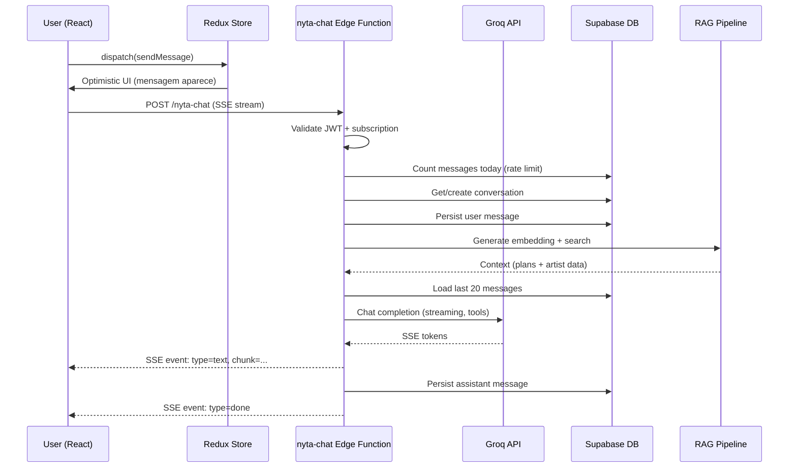
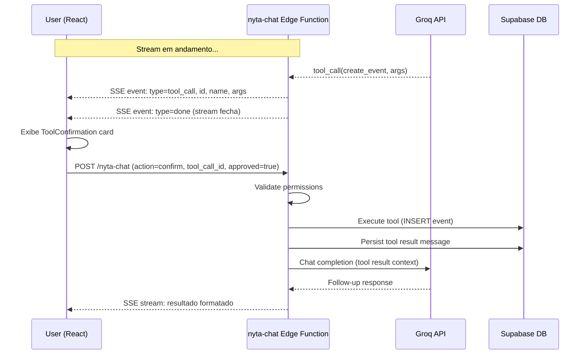
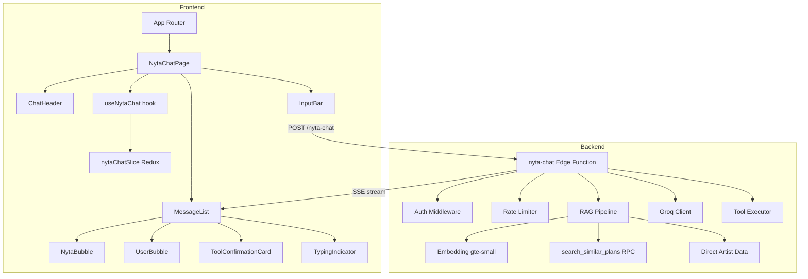
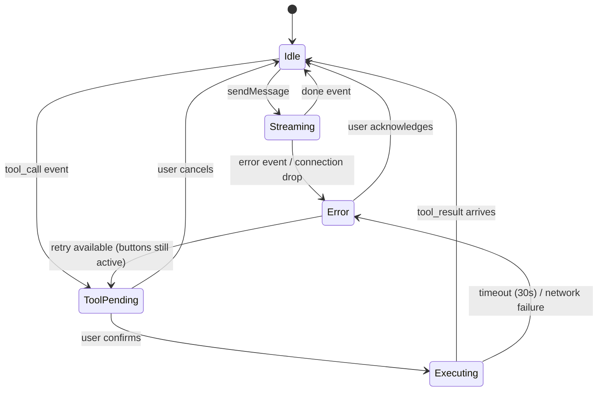

# Design Document: Nyta MVP — Chat Livre com IA

## Overview

O Nyta MVP transforma a Nyta de um wizard guiado (script determinístico) num chat aberto full-screen onde artistas Pro podem fazer perguntas livres e solicitar ações nos módulos do artista (catálogo, agenda, equipe, planejamento) via function calling com confirmação visual.

A arquitetura segue o padrão já consolidado no projeto: Edge Function Supabase (Deno) como backend, Groq/Llama como LLM, SSE para streaming, e Redux Toolkit para state management no frontend React.

### Decisões Técnicas Chave

| Decisão | Escolha | Justificativa |
|---------|---------|---------------|
| Modelo LLM | `llama-3.3-70b-versatile` via Groq | Já em uso no wizard-ai; suporte a tool_use; baixa latência |
| Streaming | SSE (Server-Sent Events) | Padrão nativo HTTP, sem necessidade de WebSocket; suportado pelo Supabase Edge Runtime |
| Embedding | `gte-small` (384d) via Supabase AI | Já utilizado no wizard-ai para RAG; sem custo adicional |
| State | Redux slice `nytaChat` | Consistente com slices existentes (auth, artists, subscription) |
| Persistência | Tabelas dedicadas `nyta_conversations` + `nyta_messages` | Separação clara do `ai_chat_messages` legado |
| Rate Limit | Contagem de mensagens por dia (UTC) | Simples, sem Redis; query na tabela existente |

## Architecture

### Data Flow — Envio de Mensagem (Happy Path)



### Data Flow — Function Calling com Confirmação



### High-Level Component Architecture



## Components and Interfaces

### Edge Function: `nyta-chat`

**Endpoint:** `POST /functions/v1/nyta-chat`

**Request Body — Message:**
```typescript
interface NytaChatRequest {
  action: 'message' | 'confirm';
  // Para action='message':
  message?: string;       // max 2000 chars
  artist_id: string;      // uuid
  // Para action='confirm':
  tool_call_id?: string;
  approved?: boolean;
}
```

**SSE Event Types:**
```typescript
// event: text
interface TextEvent {
  type: 'text';
  content: string;  // chunk de texto
}

// event: tool_call
interface ToolCallEvent {
  type: 'tool_call';
  tool_call_id: string;
  name: string;
  arguments: Record<string, unknown>;
}

// event: tool_result
interface ToolResultEvent {
  type: 'tool_result';
  tool_call_id: string;
  success: boolean;
  summary: string;  // max 500 chars
}

// event: error
interface ErrorEvent {
  type: 'error';
  message: string;  // em português
}

// event: done
interface DoneEvent {
  type: 'done';
  message_id: string;  // id da mensagem persistida
}
```

### Frontend Components

| Componente | Responsabilidade |
|-----------|-----------------|
| `NytaChatPage` | Página full-screen, controle de layout, roteamento |
| `ChatHeader` | Nome do artista, botão voltar, ação "Limpar conversa" |
| `MessageList` | Scroll infinito, auto-scroll, renderização das bolhas |
| `InputBar` | TextArea com auto-resize, send button, disabled states |
| `ToolConfirmationCard` | Exibe ação proposta com Confirmar/Cancelar |
| `RateLimitBanner` | Exibe contagem e countdown do reset |

### Redux Slice: `nytaChat`

```typescript
interface NytaChatState {
  conversationId: string | null;
  messages: NytaMessage[];
  isStreaming: boolean;
  pendingToolCalls: PendingToolCall[];
  rateLimitInfo: {
    count: number;
    limit: number;
    resetAt: string | null;
  } | null;
  loadingHistory: boolean;
  hasMoreHistory: boolean;
  error: string | null;
}

interface NytaMessage {
  id: string;
  role: 'user' | 'assistant' | 'tool';
  content: string | null;
  toolCalls?: ToolCall[];
  toolResults?: ToolResult[];
  createdAt: string;
  status: 'sending' | 'sent' | 'error';
}

interface PendingToolCall {
  toolCallId: string;
  name: string;
  arguments: Record<string, unknown>;
  status: 'pending' | 'confirmed' | 'cancelled' | 'executing' | 'done' | 'error';
}
```

### Hook: `useNytaChat`

```typescript
interface UseNytaChatReturn {
  messages: NytaMessage[];
  isStreaming: boolean;
  pendingToolCalls: PendingToolCall[];
  rateLimitInfo: NytaChatState['rateLimitInfo'];
  loadingHistory: boolean;
  hasMoreHistory: boolean;
  error: string | null;
  sendMessage: (text: string) => void;
  confirmTool: (toolCallId: string) => void;
  cancelTool: (toolCallId: string) => void;
  loadOlderMessages: () => void;
  clearConversation: () => void;
}
```

### Tool Definitions (Function Calling)

```typescript
const NYTA_TOOLS = [
  {
    type: 'function',
    function: {
      name: 'create_catalog_item',
      description: 'Criar um novo item no catálogo do artista',
      parameters: {
        type: 'object',
        properties: {
          title: { type: 'string', description: 'Título da faixa' },
          status: { type: 'string', enum: ['composition','recording','production','mixing','mastering','released'] },
          genre: { type: 'string', description: 'Gênero musical' },
        },
        required: ['title'],
      },
    },
  },
  // update_catalog_item, delete_catalog_item,
  // create_event, update_event, delete_event,
  // create_team_member, update_team_member, remove_team_member,
  // update_strategy_task
] as const;
```

## Data Models

### Database Schema

```sql
-- Conversas: uma por (user_id, artist_id)
CREATE TABLE nyta_conversations (
  id          uuid PRIMARY KEY DEFAULT gen_random_uuid(),
  user_id     uuid NOT NULL REFERENCES auth.users(id),
  artist_id   uuid NOT NULL REFERENCES artists(id),
  created_at  timestamptz NOT NULL DEFAULT now(),
  updated_at  timestamptz NOT NULL DEFAULT now(),
  UNIQUE (user_id, artist_id)
);

-- Mensagens dentro de uma conversa
CREATE TABLE nyta_messages (
  id              uuid PRIMARY KEY DEFAULT gen_random_uuid(),
  conversation_id uuid NOT NULL REFERENCES nyta_conversations(id) ON DELETE CASCADE,
  role            text NOT NULL CHECK (role IN ('user', 'assistant', 'tool')),
  content         text,
  tool_calls      jsonb,
  tool_results    jsonb,
  created_at      timestamptz NOT NULL DEFAULT now(),
  -- user e assistant devem ter content
  CONSTRAINT content_required CHECK (
    (role = 'tool') OR (content IS NOT NULL)
  )
);

-- Índice principal para paginação
CREATE INDEX idx_nyta_messages_conv_created
  ON nyta_messages(conversation_id, created_at DESC);

-- Índice parcial para rate limiting (somente role='user')
CREATE INDEX idx_nyta_messages_rate_limit
  ON nyta_messages(conversation_id, created_at)
  WHERE role = 'user';
```

### RLS Policies

```sql
-- nyta_conversations
ALTER TABLE nyta_conversations ENABLE ROW LEVEL SECURITY;

CREATE POLICY "Users can access own conversations"
  ON nyta_conversations FOR ALL
  USING (user_id = auth.uid());

-- nyta_messages
ALTER TABLE nyta_messages ENABLE ROW LEVEL SECURITY;

CREATE POLICY "Users can access messages from own conversations"
  ON nyta_messages FOR ALL
  USING (
    conversation_id IN (
      SELECT id FROM nyta_conversations WHERE user_id = auth.uid()
    )
  );
```

### SSE Event Schema (TypeScript)

```typescript
// Formato de cada linha no SSE stream
// data: {"type":"text","content":"Olá! "}
// data: {"type":"tool_call","tool_call_id":"call_123","name":"create_event","arguments":{...}}
// data: {"type":"error","message":"Falha ao processar..."}
// data: {"type":"done","message_id":"uuid"}
```

### Tool Call JSONB Schema (stored in nyta_messages.tool_calls)

```typescript
interface StoredToolCall {
  id: string;          // tool_call_id from Groq
  name: string;        // function name
  arguments: object;   // parsed JSON arguments
  status: 'pending' | 'approved' | 'denied';
}

// nyta_messages.tool_results (role='tool')
interface StoredToolResult {
  tool_call_id: string;
  success: boolean;
  summary: string;     // max 500 chars
  error?: string;
}
```

## Correctness Properties

*A property is a characteristic or behavior that should hold true across all valid executions of a system — essentially, a formal statement about what the system should do. Properties serve as the bridge between human-readable specifications and machine-verifiable correctness guarantees.*

### Property 1: Pagination returns complete messages without gaps or duplicates

*For any* conversation with N messages (N ≥ 0), loading messages in batches of 50 via infinite scroll SHALL return all N messages in chronological order (oldest first) with no duplicates and no gaps between batches.

**Validates: Requirements 1.7**

### Property 2: RAG context respects token budget

*For any* combination of semantic search results and direct artist data of arbitrary lengths, the total context injected into the system prompt SHALL NOT exceed 4000 tokens, with semantic results capped at 2500 tokens and direct data capped at 1500 tokens, truncating excess content.

**Validates: Requirements 5.4**

### Property 3: Tool calls are never auto-executed

*For any* Groq API response containing one or more tool_calls, the Edge Function SHALL emit SSE events of type `tool_call` for each and SHALL NOT execute any tool until an explicit confirmation is received from the frontend.

**Validates: Requirements 2.4**

### Property 4: Conversation context window is bounded

*For any* conversation of length N (N ≥ 0), the messages included in the Groq API call SHALL be exactly min(N, 20), consisting of the most recent messages in chronological order.

**Validates: Requirements 2.9**

### Property 5: Input validation rejects oversized and malformed requests

*For any* message string of length > 2000 characters, OR any request body missing the `message` field, OR any request body missing the `artist_id` field, the Edge Function SHALL return HTTP 400 without persisting or calling Groq.

**Validates: Requirements 2.11**

### Property 6: Tool calls cannot cross artist boundaries

*For any* tool call where the `artist_id` parameter differs from the conversation's artist_id, the Edge Function SHALL reject the tool call and return an error to the model without executing.

**Validates: Requirements 3.2, 3.3**

### Property 7: Tool execution requires ownership or membership

*For any* authenticated user who is neither the owner (`artists.user_id`) nor a member in `artist_members` for the target artist_id, the Edge Function SHALL reject tool execution with an insufficient permissions error.

**Validates: Requirements 3.4, 3.9**

### Property 8: ToolConfirmation card renders all required fields

*For any* tool_call event with an arbitrary function name and arguments object, the ToolConfirmationCard SHALL render: the action name (translated to Portuguese), the target entity, and all arguments as labeled fields.

**Validates: Requirements 4.1**

### Property 9: Message input is disabled while tool calls are pending

*For any* state where one or more PendingToolCalls have status `pending`, the message input field SHALL be disabled and the send button SHALL be non-interactive.

**Validates: Requirements 4.5**

### Property 10: Tool action summary respects character limit

*For any* tool call with arguments of arbitrary length, the rendered action detail summary in the ToolConfirmationCard SHALL NOT exceed 200 characters, truncating with ellipsis if necessary.

**Validates: Requirements 4.6**

### Property 11: Multiple tool calls produce individual confirmation cards

*For any* assistant response containing N tool_calls (1 ≤ N), the MessageList SHALL render exactly N ToolConfirmationCard components, each independently confirmable or cancellable.

**Validates: Requirements 4.9**

### Property 12: Rate limiter rejects at threshold

*For any* (user_id, artist_id) pair where the count of user-role messages with `created_at` on the current UTC date is ≥ 100, the Edge Function SHALL reject the incoming message with HTTP 429 and SHALL NOT persist it or call Groq.

**Validates: Requirements 6.1, 6.2, 6.5**

### Property 13: Subscription validation gates access

*For any* authenticated user without an active subscription (status ≠ `active`, AND NOT status `overdue` with billing due within 7 days), AND `PAYWALL_DISABLED` is false, the Edge Function SHALL return HTTP 403 with `error: 'subscription_required'`.

**Validates: Requirements 7.3, 7.4**

### Property 14: Message alignment matches role

*For any* message in the thread, messages with role `assistant` SHALL render with left alignment (with NytaAvatar), and messages with role `user` SHALL render with right alignment, using `NytaBubble` and `UserBubble` components respectively.

**Validates: Requirements 8.3**

### Property 15: Send button disabled for whitespace-only input

*For any* string composed entirely of whitespace characters (including the empty string), the send button SHALL remain disabled and pressing Enter SHALL NOT trigger a message send.

**Validates: Requirements 8.5**

### Property 16: RAG semantic search bounded to 3 results

*For any* user message embedding, the semantic search query to `search_similar_plans` SHALL request at most 3 results (`match_count: 3`) with `match_threshold: 0.4`, and the Edge Function SHALL inject at most 3 plan references into the system prompt.

**Validates: Requirements 2.3, 5.2**

## Error Handling

### Edge Function Error Strategy

| Error Source | Behavior | HTTP Status | SSE Event |
|-------------|----------|-------------|-----------|
| Invalid/missing JWT | Immediate rejection | 401 | — |
| Missing subscription | Immediate rejection | 403 | — |
| Invalid request body | Immediate rejection | 400 | — |
| Rate limit exceeded | Immediate rejection | 429 | — |
| Rate limit DB query fails | Immediate rejection (safe default) | 503 | — |
| Conversation create fails | Stream opened then error | 200 | `error` |
| Message persist fails | Stream opened then error | 200 | `error` |
| Embedding generation fails | Graceful degradation | — | — (proceeds without RAG) |
| Semantic search fails/timeout | Graceful degradation | — | — (proceeds with direct data) |
| Direct data query fails | Graceful degradation | — | — (proceeds with semantic only) |
| Both RAG sources fail | Proceeds with notice in prompt | — | — |
| Groq API error | SSE error event, close stream | 200 | `error` |
| Groq timeout (30s) | SSE error event, close stream | 200 | `error` |
| Tool validation failure | Error returned to model, user informed | — | `text` (via model) |
| Tool execution DB error | Error returned to model, user informed | — | `text` (via model) |
| Tool confirmation timeout (30s) | Frontend re-enables input, shows error | — | — |

### Frontend Error Recovery



### Fallback Hierarchy (RAG)

1. Full context: semantic results + direct artist data
2. Direct data only: embedding or search fails
3. Semantic only: direct data query fails
4. No context: both sources fail (notice injected in system prompt)

## Testing Strategy

### Property-Based Testing (PBT)

**Library:** `fast-check` (already in devDependencies v3.23.2)

**Configuration:** Minimum 100 iterations per property test.

**Tag format:** `Feature: nyta-mvp, Property {N}: {description}`

Properties to implement as PBT:

| # | Property | Target Layer |
|---|----------|-------------|
| 1 | Pagination completeness | Frontend (useNytaChat) |
| 2 | RAG token budget | Edge Function (context builder) |
| 3 | Tool calls not auto-executed | Edge Function (stream handler) |
| 4 | Context window bounded to 20 | Edge Function (message loader) |
| 5 | Input validation | Edge Function (request validator) |
| 6 | Cross-artist tool rejection | Edge Function (tool executor) |
| 7 | Ownership/membership guard | Edge Function (tool executor) |
| 8 | ToolConfirmation renders fields | Frontend (ToolConfirmationCard) |
| 9 | Input disabled while pending | Frontend (InputBar) |
| 10 | Summary ≤200 chars | Frontend (ToolConfirmationCard) |
| 11 | N tool_calls → N cards | Frontend (MessageList) |
| 12 | Rate limit at threshold | Edge Function (rate limiter) |
| 13 | Subscription validation | Edge Function (auth middleware) |
| 14 | Message alignment by role | Frontend (MessageList) |
| 15 | Whitespace → disabled send | Frontend (InputBar) |
| 16 | RAG bounded to 3 results | Edge Function (RAG pipeline) |

### Unit Tests (Example-Based)

- Auth flow: valid JWT, invalid JWT, missing JWT
- Tool confirmation: approve flow, deny flow, timeout recovery
- SSE parsing: text chunks, tool_call events, error events, done events
- Empty state: greeting bubble on no messages
- Clear conversation: confirmation dialog + deletion
- Rate limit UI: 429 response → countdown display
- LockedFeature: renders when entitlement is false

### Integration Tests

- Full message round-trip: send → stream → persist → reload
- RAG pipeline: embedding → search → context injection
- Tool execution: confirm → DB write → follow-up response
- Pagination: insert 120 messages → load 3 batches → verify order

### Edge Case Coverage (via generators in PBT)

- Empty message string (whitespace variations)
- Message at exactly 2000 chars (boundary)
- Message at 2001 chars (rejection boundary)
- Conversation with 0, 1, 19, 20, 21 messages (context window boundaries)
- Rate limit at exactly 99, 100, 101 messages
- Tool call with empty arguments object
- Tool call with deeply nested arguments
- Unicode/emoji in messages and tool arguments
- Concurrent tool calls (2-3 simultaneous)
- Subscription status transitions (active → overdue → grace period boundary)

